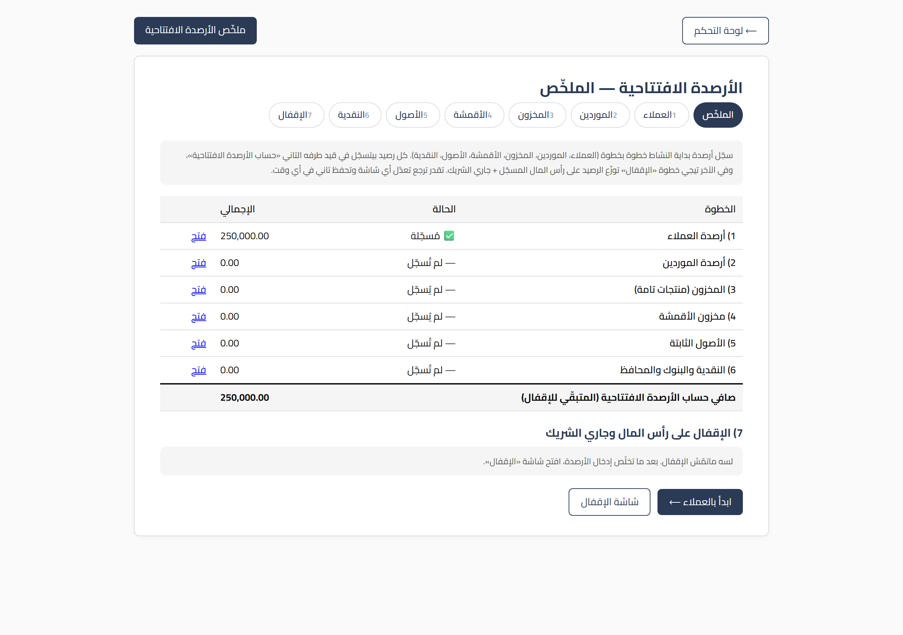
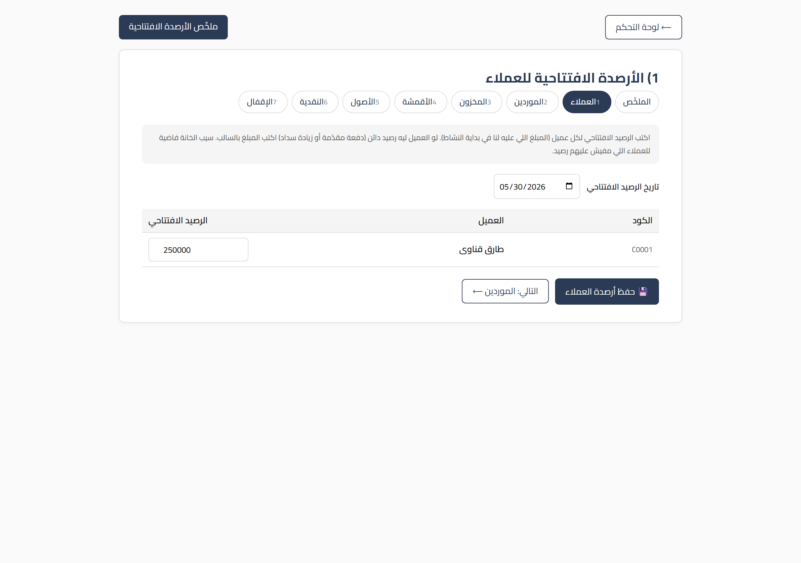
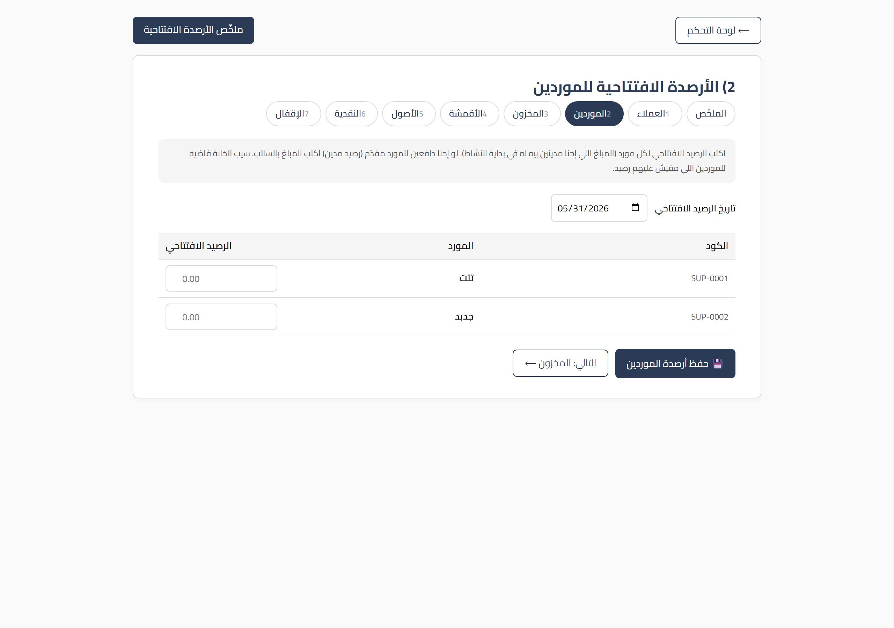
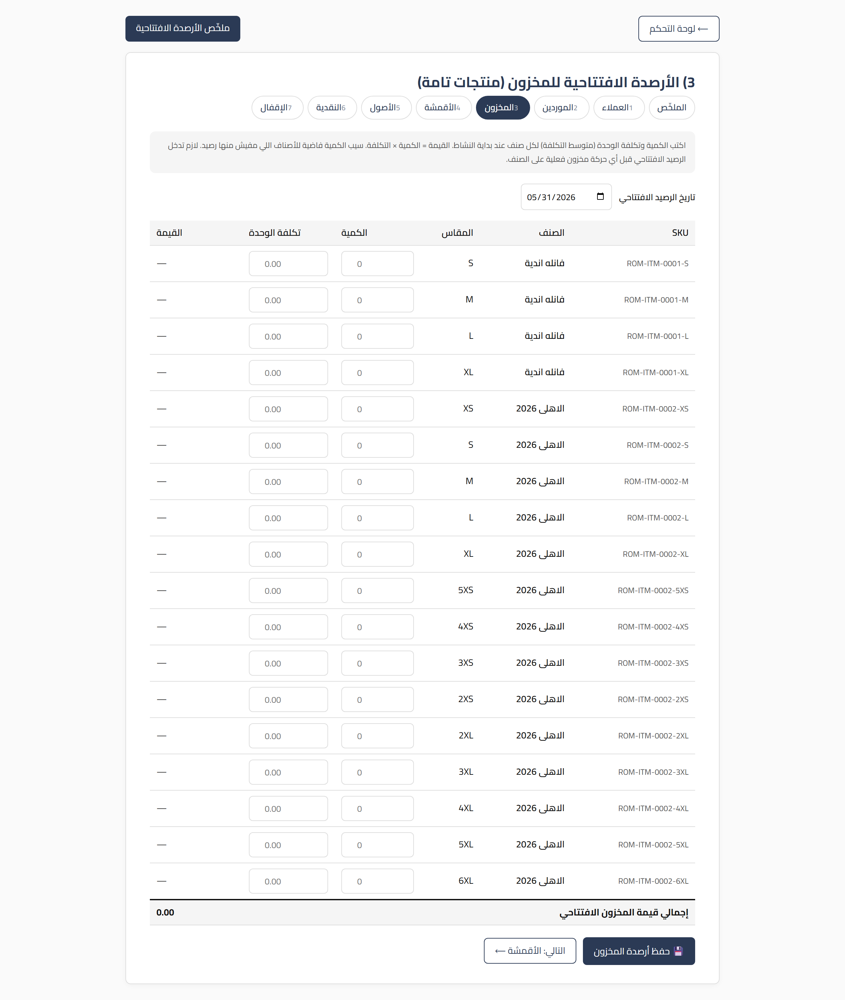
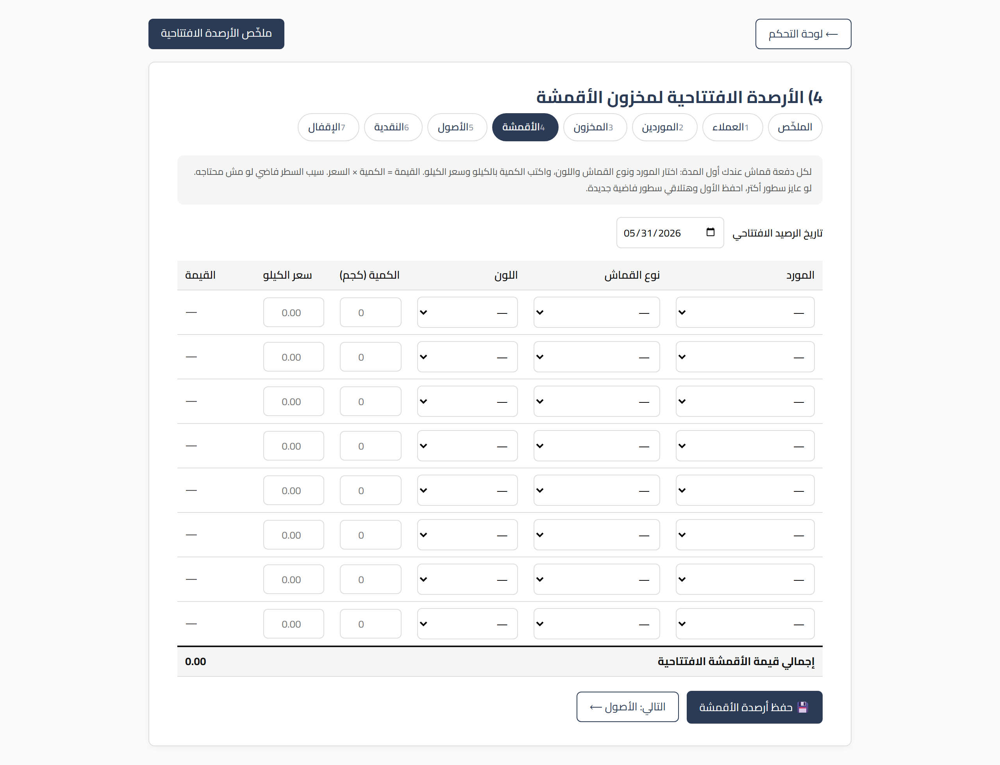
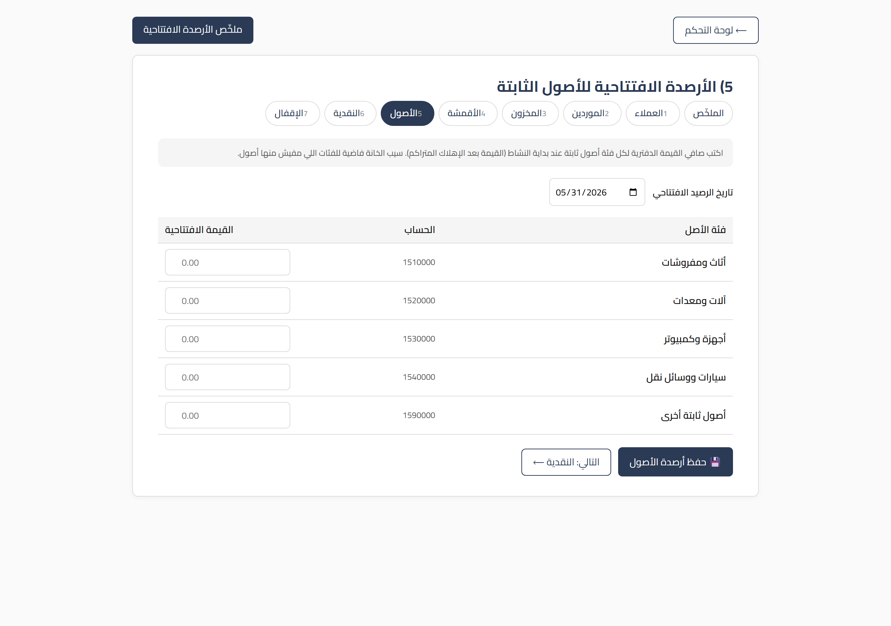
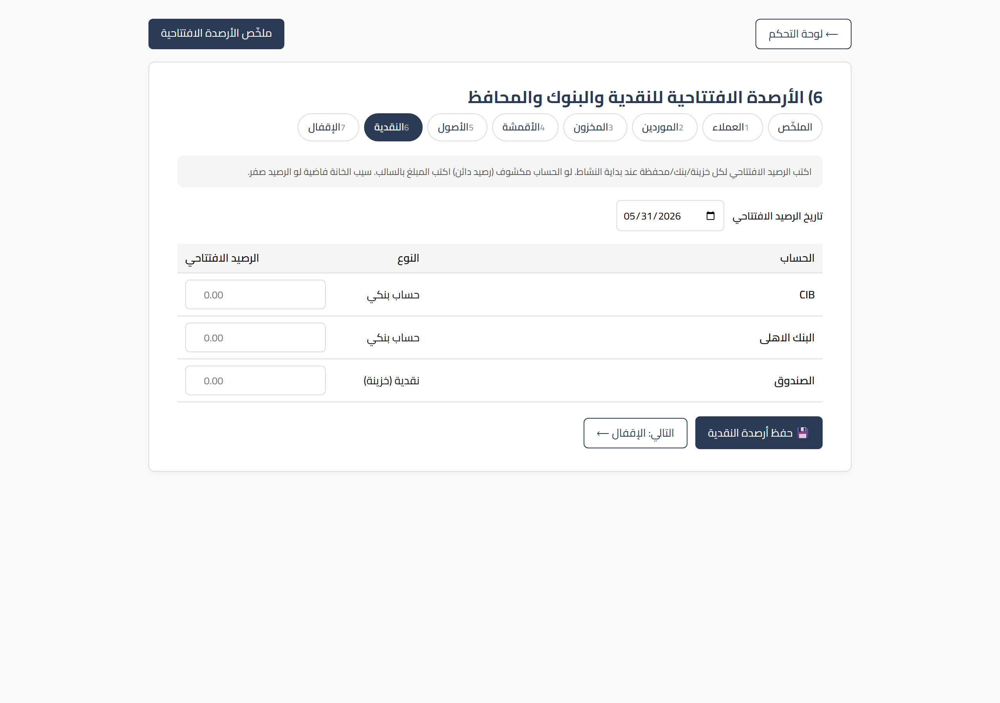
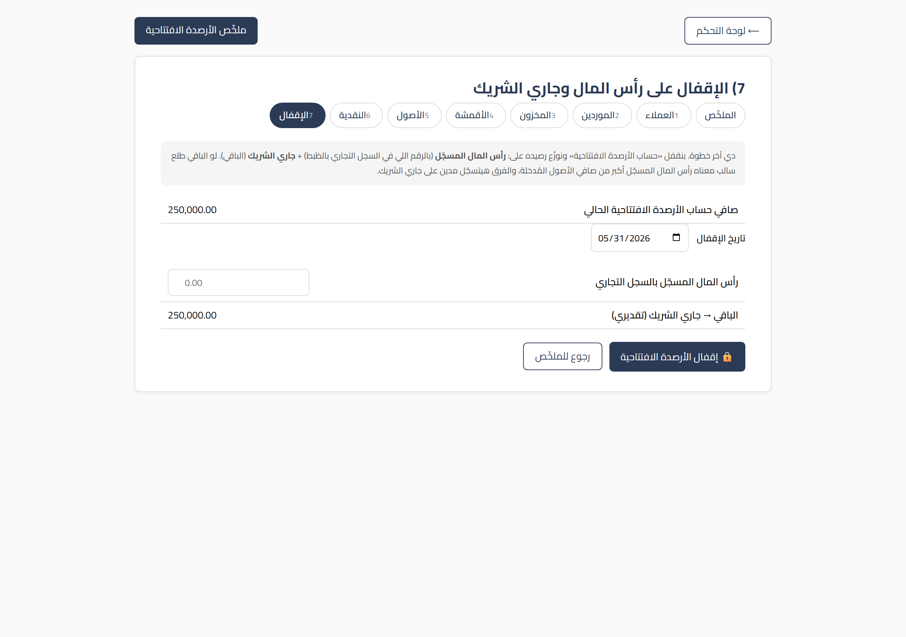

# دليل تسجيل الأرصدة الافتتاحية — نظام Roma ERP

> الدليل ده مخصوص لخطوة بتتعمل **مرة واحدة بس** في عمر الشركة على السيستم: إدخال **الأرصدة الافتتاحية** (يعني الأرقام اللي الشركة بادئة بيها يوم ما اشتغلت على البرنامج).
> غالباً اللي بيعمل الخطوة دي هو **المدير أو المحاسب**، مش أي موظف عادي.
> اقرا **الجزء الأول كله بالراحة** قبل ما تلمس أي شاشة، عشان تفهم انت بتعمل إيه أصلاً. بعد كده الخطوات بسيطة جداً.

---

# الجزء الأول: افهم الموضوع الأول

## 0.1 يعني إيه "أرصدة افتتاحية"؟

تخيّل إن شركتك شغّالة من سنين بالورق والدفاتر، والنهاردة قررت تدخل كل حاجة على السيستم. السيستم **لسه متولد دلوقتي**، فهو مش عارف حاجة عن اللي فات: مش عارف مين العملاء اللي ليك عندهم فلوس، ولا المخزن اللي في الدكان، ولا الفلوس اللي في الدرج.

**الأرصدة الافتتاحية** = إنك تقول للسيستم: "اسمع، احنا مش بادئين من الصفر، ده **وضع الشركة الحقيقي يوم ما بدأنا عليك**". يعني بتصوّرله الشركة لحظة الانطلاق.

> ### مثال يقرّب الصورة:
> العميل **أحمد** كان واخد منك بضاعة بـ **5,000 جنيه** ولسه ما دفعش، **قبل** ما تشتري السيستم خالص.
> لما تدخل السيستم لأول مرة، لازم تقوله "أحمد عليه 5,000". ده **رصيد افتتاحي**.
> لو ما عملتش كده، السيستم هيفتكر إن أحمد ما عليهوش حاجة، وهتنسى الـ 5,000 دول.

نفس الكلام على:
- **العملاء** اللي ليك عندهم فلوس.
- **الموردين** اللي انت عليك لهم فلوس.
- **المخزن**: البضاعة والقماش اللي موجودين فعلاً عندك.
- **الأصول الثابتة**: العربيات، الماكينات، الأثاث، الكمبيوترات.
- **النقدية والبنوك**: الفلوس اللي في الخزنة وفي حساباتك بالبنك.

---

## 0.2 إزاي السيستم بيوازن نفسه؟ (مفهوم مهم بس سهل)

في المحاسبة فيه قاعدة حديدية: **أي رصيد بتدخّله لازم يبقى ليه طرف تاني يوازنه**. مينفعش تقول "عندي بضاعة بـ 80 ألف" من غير ما تقول "البضاعة دي جت منين".

عشان نسهّلها عليك، السيستم بيستخدم **حساب وسيط** اسمه **«حساب الأرصدة الافتتاحية»**. كل رصيد بتدخّله بيروح طرف منه على الحساب الحقيقي (العميل، المخزن، النقدية...) والطرف التاني بيتجمّع في الحساب الوسيط ده مؤقتاً.

في **آخر خطوة** (الإقفال) السيستم بيفرّغ الحساب الوسيط ده ويوزّعه على حاجتين:

1. **رأس المال المسجّل**: الرقم اللي في **السجل التجاري** بالظبط (اللي انت أسّست الشركة بيه رسمياً).
2. **جاري الشريك**: الباقي. يعني الفرق بين صافي أصول الشركة الحقيقي ورأس المال المسجّل بيتسجّل على إنه **مستحق للشريك/المالك** (أو عليه لو طلع بالسالب).

> **مش لازم تفهم المحاسبة عشان تعمل ده.** السيستم بيحسب كل ده لوحده. انت بس بتدخّل الأرقام الحقيقية، وبتكتب رأس المال المسجّل في آخر خطوة، والباقي عليه.

> **ملاحظة عن المستخدم:** كل القيود الافتتاحية بتتسجّل باسم مستخدم مخصوص اسمه **«الأرصدة الافتتاحية»**. ده **مش مستخدم بيدخل بيه حد** — هو بس عشان تبان القيود دي واضحة ومتميّزة عن الشغل اليومي. متقلقش منه.

---

## 0.3 الترتيب الصح (مهم جداً متخالفهوش)

عشان الأرصدة الافتتاحية تطلع صح، فيه ترتيب لازم تمشي عليه:

1. **جهّز "الكتالوجات" الأول.** الشاشات دي **بتضيف رصيد لسجل موجود**، مش بتنشئ سجلات جديدة. يعني:
   - لازم تكون مسجّل **العملاء** قبل ما تدخّل أرصدتهم.
   - لازم تكون مسجّل **الموردين** و**الأصناف/الـ SKUs** و**الخزائن والبنوك** الأول.
   - لو لقيت شاشة فاضية، ده معناه إنك لسه ما سجّلتش السجلات دي — ارجع سجّلها من شاشاتها العادية وبعدين تعالى هنا.

2. **دخّل الأرصدة الافتتاحية قبل أي معاملة حقيقية.** يعني قبل ما تعمل أول فاتورة بيع أو أول شراء على السيستم. الأرصدة الافتتاحية بتمثّل **لحظة الصفر**، فلازم تتسجّل قبل أي حركة.

3. **الإقفال آخر حاجة.** بعد ما تخلّص كل الأرصدة (عملاء، موردين، مخزون، قماش، أصول، نقدية)، ساعتها بس روح خطوة **الإقفال** واكتب رأس المال.

> **القاعدة:** كتالوجات ← أرصدة افتتاحية ← إقفال ← وبعد كده الشغل اليومي العادي.

---

## 0.4 نصايح تريّحك قبل ما تبدأ

- **كله قابل للتعديل.** لو دخلت رقم غلط، ارجع لنفس الشاشة، صلّحه، واحفظ تاني. السيستم بيمسح القيد القديم ويكتب الجديد لوحده (مفيش تكرار ولا تزويد غلط).
- **سيب الخانة فاضية لو الرصيد صفر.** مش لازم تكتب صفر بإيدك؛ الخانة الفاضية معناها "مفيش رصيد".
- **شكل الأرقام:** السيستم بيكتب الأرقام بالشكل ده **5,500.00** — الفاصلة (,) بتفصل الآلاف، والنقطة (.) للكسور (القروش). اكتب الأرقام عادي والسيستم هينسّقها.
- **خانة التاريخ:** فوق كل شاشة فيه **تاريخ الرصيد الافتتاحي**. خليه تاريخ بداية النشاط على السيستم (غالباً أول الشهر أو أول السنة اللي بدأت فيها). خليه ثابت في كل الشاشات.

---

## 0.5 إزاي توصل شاشات الأرصدة الافتتاحية

فيه طريقتين:

1. **من لوحة التحكم (الصفحة الرئيسية):** هتلاقي قسم اسمه **«الأرصدة الافتتاحية (بداية النشاط)»** فيه كروت بتوديك لكل شاشة على طول.
2. **من العنوان مباشرة:** اكتب في المتصفح `http://localhost:8001/opening/` وهتلاقي **شاشة الملخّص** اللي منها بتنط لأي خطوة.

---

# الجزء الثاني: شاشة الملخّص (نقطة البداية)

أول ما تفتح `/opening/` هتلاقي **شاشة الملخّص**. دي بتوريك:

- **خطوات الإدخال بالترتيب** (عملاء، موردين، مخزون، قماش، أصول، نقدية، إقفال) كروابط تنط منها لأي خطوة.
- **حالة كل خطوة** ومجاميع مبدئية، عشان تعرف انت وصلت لفين.
- **زر/رابط للإقفال** في الآخر.

ابدأ من فوق لتحت بالترتيب. كل ما تخلّص خطوة، ارجع للملخّص أو استخدم زر **"التالي"** اللي تحت كل شاشة.

---

# الجزء الثالث: إدخال الأرصدة خطوة خطوة

> **في كل شاشة:** اكتب الأرقام في الخانات، اتأكد من **التاريخ** فوق، وبعدين دوس زر **الحفظ** تحت. من غير حفظ مفيش حاجة بتتسجّل.

## الخطوة 1 — أرصدة العملاء

**الغرض:** تقول للسيستم كل عميل عليه/ليه كام لحظة البداية.

- هتلاقي **ليستة العملاء** اللي مسجّلين، وقدام كل واحد خانة "الرصيد الافتتاحي".
- **رقم موجب (+):** العميل **مدين لك** (واخد بضاعة وما دفعش). ده الطبيعي والأكثر.
- **رقم سالب (−):** العميل **دافعلك مقدّم** (عربون/دفعة تحت الحساب لسه ما اخدش بضاعتها).

> **مثال:** أحمد عليه 5,000 ⟵ اكتب `5000`. سمير دافع مقدّم 1,200 ⟵ اكتب `1200-`.

---

## الخطوة 2 — أرصدة الموردين

**الغرض:** تقول للسيستم انت عليك كام لكل مورد لحظة البداية.

- **رقم موجب (+):** انت **عليك للمورد** (خدت منه بضاعة/قماش وما دفعتش). ده الطبيعي.
- **رقم سالب (−):** انت **دافعله مقدّم** (دفعت قبل ما تستلم).

> لاحظ إن إشارة الموردين **معكوسة** عن العملاء: عند العميل الموجب معناه "ليك"، وعند المورد الموجب معناه "عليك".

---

## الخطوة 3 — أرصدة المخزون (الأصناف)

**الغرض:** تقول للسيستم كل صنف عندك منه **كام قطعة** و**بكام تكلفة القطعة**.

- لكل SKU فيه خانتين: **الكمية** و**تكلفة الوحدة**.
- **اكتب التكلفة (سعر الشراء/التصنيع)، مش سعر البيع.** قيمة المخزون لازم تكون بالتكلفة.
- السيستم بيضرب الكمية × التكلفة ويطلّع قيمة الصنف، وبيجمّع الكل تحت.

> **مهم:** لو الصنف عليه حركات حقيقية بالفعل (اتباع أو اتحرّك على السيستم)، الشاشة **هترفض** تسجّل له رصيد افتتاحي — عشان كده الأرصدة الافتتاحية لازم تتدخّل **قبل** أي معاملة.

---

## الخطوة 4 — أرصدة القماش (الخامات)

**الغرض:** تسجّل أرصدة القماش الموجودة في المخزن لحظة البداية، كل "لفّة/دفعة" على حدة.

لكل سطر قماش لازم تكتب:
- **المورد** اللي جه منه القماش (تختاره من ليستة).
- **نوع القماش** و**اللون**.
- **الكمية بالكيلو**.
- **سعر الكيلو** (التكلفة).

تقدر تزوّد سطور حسب عدد أنواع/ألوان القماش اللي عندك. السيستم بيعمل لكل سطر **دفعة قماش** في المخزن.

---

## الخطوة 5 — أرصدة الأصول الثابتة

**الغرض:** تسجّل قيمة الحاجات الكبيرة اللي بتفضل مع الشركة (عربيات، ماكينات، أثاث، كمبيوترات...).

- هتلاقي **فئات** جاهزة (أثاث ومفروشات، آلات ومعدات، أجهزة وكمبيوتر، سيارات ووسائل نقل، أصول أخرى).
- قدام كل فئة اكتب **صافي القيمة الدفترية** = القيمة **بعد** خصم الإهلاك المتراكم.

> ### مثال مهم:
> ماكينة اشتريتها بـ **100,000** وعدّى عليها زمن واتهلكت بـ **30,000**.
> القيمة اللي تكتبها هنا = `70000` (مش 100,000).

---

## الخطوة 6 — أرصدة النقدية والبنوك والمحافظ

**الغرض:** تسجّل الفلوس اللي عندك فعلاً لحظة البداية، في كل خزنة/بنك/محفظة.

- هتلاقي **ليستة الخزائن والبنوك والمحافظ** المسجّلة، وقدام كل واحدة خانة الرصيد.
- **رقم موجب (+):** رصيد عادي (فلوس موجودة). ده الطبيعي.
- **رقم سالب (−):** الحساب **مكشوف** (overdraft) — يعني سحبت أكتر من اللي فيه.

---

# الجزء الرابع: الإقفال (آخر خطوة)

بعد ما تخلّص **كل** الأرصدة اللي فوق، تيجي الخطوة الأخيرة: **الإقفال على رأس المال وجاري الشريك**.

**الخطوات:**
1. افتح شاشة **الإقفال** (من الملخّص أو كارت "الإقفال").
2. هتلاقي فوق **«صافي حساب الأرصدة الافتتاحية الحالي»** — ده مجموع كل اللي دخلته (صافي الأصول).
3. اكتب في خانة **«رأس المال المسجّل بالسجل التجاري»** الرقم الرسمي اللي أسّست بيه الشركة.
4. السيستم هيوريك تحتها على طول **«الباقي → جاري الشريك (تقديري)»**.
5. راجع، وبعدين دوس زر **🔒 إقفال الأرصدة الافتتاحية**.

> **لو الباقي طلع بالسالب:** معناه إن رأس المال المسجّل **أكبر** من صافي أصول الشركة الحقيقي، والفرق هيتسجّل **مدين على جاري الشريك** (يعني الشريك عليه للشركة). ده عادي محاسبياً، بس اتأكد إن الأرقام صح.

---

## مثال كامل من الأول للآخر

خلّينا نتخيّل شركة دخلت الأرصدة دي:

| البند | القيمة |
|---|---|
| أرصدة العملاء (ليك عندهم) | 50,000 |
| أرصدة الموردين (عليك لهم) | (20,000) |
| المخزون | 80,000 |
| النقدية والبنوك | 30,000 |
| الأصول الثابتة | 100,000 |
| **صافي حساب الأرصدة الافتتاحية** | **240,000** |

دلوقتي في الإقفال:
- رأس المال المسجّل بالسجل التجاري = **100,000**.
- الباقي = 240,000 − 100,000 = **140,000** ⟵ بيروح **جاري الشريك**.

يعني الشركة بدأت برأس مال 100,000، وبصافي أصول 240,000، والفرق (140,000) محسوب على إنه **مستحق للشريك** (كإنه ضخّ في الشركة أكتر من رأس المال المسجّل).

---

# أسئلة بتتسأل كتير (FAQ)

**س: دخلت رقم غلط وحفظت، أعمل إيه؟**
ج: عادي خالص. ارجع لنفس الشاشة، صلّح الرقم، واحفظ تاني. السيستم بيمسح القديم ويكتب الجديد لوحده.

**س: لقيت شاشة فاضية (مفيش عملاء/أصناف)؟**
ج: معناه إنك لسه ما سجّلتش السجلات دي من شاشاتها العادية. سجّلها الأول وبعدين تعالى دخّل أرصدتها.

**س: أعملها كام مرة؟**
ج: مرة واحدة بس وقت ما تبدأ الشركة على السيستم. مش حاجة يومية.

**س: نسيت أدخل رصيد عميل ولقيته بعد ما عملت الإقفال؟**
ج: ضيف الرصيد من شاشة العملاء، وبعدين **اعمل الإقفال تاني** عشان السيستم يعيد التوزيع صح.

**س: أكتب التكلفة ولا سعر البيع في المخزون؟**
ج: **التكلفة** دايماً (سعر الشراء/التصنيع). المخزون بيتقيّم بالتكلفة مش بسعر البيع.

**س: الباقي في الإقفال طلع بالسالب، فيه غلط؟**
ج: مش بالضرورة. معناه رأس المال المسجّل أكبر من صافي الأصول. بس راجع أرقامك للتأكيد.

---

# خلاصة سريعة (للي مستعجل)

1. **جهّز الكتالوجات الأول** (عملاء، موردين، أصناف، خزائن) من شاشاتهم العادية.
2. ادخل `/opening/` أو قسم **الأرصدة الافتتاحية** في لوحة التحكم.
3. دخّل بالترتيب: **عملاء ← موردين ← مخزون ← قماش ← أصول ← نقدية**. احفظ كل شاشة.
4. تأكّد إن **التاريخ** ثابت في كل الشاشات.
5. روح **الإقفال**، اكتب **رأس المال المسجّل**، شوف الباقي، ودوس **إقفال**.
6. خلاص! الشركة بقت متظبّطة على السيستم، تقدر تبدأ شغلك اليومي العادي.

> **افتكر:** كله قابل للتعديل، وأي شاشة فاضية معناها سجلات ناقصة. خد وقتك، وراجع قبل الإقفال.
