# دليل تدريب مستخدمي نظام Roma ERP

> الدليل ده متكتوب لحد **بيفتح السيستم لأول مرة في حياته**.
> مش مفروض تعرف أي حاجة عن "البرامج المحاسبية" قبل ما تقراه.
> هنمشي خطوة خطوة، ونشرح كل كلمة غريبة أول ما تقابلنا.
> خد وقتك، واقرا القسم رقم (0) كله بالراحة قبل ما تبدأ تشتغل.

---

# الجزء الأول: قبل ما تبدأ خالص

## 0.1 السيستم ده بيعمل إيه أصلاً؟

تخيّل إن كل الورق اللي بتشتغل بيه في الشركة — دفتر الفواتير، دفتر العملاء، كشف المخزن، فواتير الموردين، أوامر التشغيل في المصنع — اتحوّل لمكان واحد على الكمبيوتر.

السيستم ده بيعمل 3 حاجات أساسية لوحده وانت مش حاسس:
1. **بيحسب الفلوس:** أول ما تعمل فاتورة بيع، بيعرف إن العميل بقى مدين لك بكام، ولو دفع بيخصم من حسابه.
2. **بيتابع المخزن:** أول ما تبيع قطعة، بيقللها من المخزن لوحده. وأول ما يتصنّع منتج، بيزوّده.
3. **بيكتب الدفاتر المحاسبية:** القيود اللي زمان كان المحاسب بيكتبها بإيده، السيستم بيعملها أوتوماتيك.

**انت شغلتك:** تدخّل البيانات صح (مين العميل، باع إيه، بكام)، والباقي على السيستم.

---

## 0.2 إزاي تفتح السيستم وتدخل (Login)

1. على شاشة الكمبيوتر هتلاقي برنامج اسمه **متصفح الإنترنت** (Browser) — أيقونته غالباً دايرة ملونة (Chrome / Edge). افتحه بدوسة دبل-كليك.

2. فوق خالص فيه **شريط أبيض طويل** (اسمه شريط العنوان). اكتب فيه العنوان اللي المدير هيديهولك، غالباً حاجة زي كده:

   `http://localhost:8001/admin/`

   وبعدين دوس **Enter** من الكيبورد.

3. هتظهرلك شاشة فيها خانتين:
   - **اسم المستخدم (Username):** اكتب الاسم اللي استلمته من المدير.
   - **كلمة السر (Password):** اكتب الباسورد. (هيظهر نقط ●●● بدل الحروف — ده طبيعي وعشان حد ميشوفهاش).

4. دوس زر **تسجيل الدخول / Log in**.

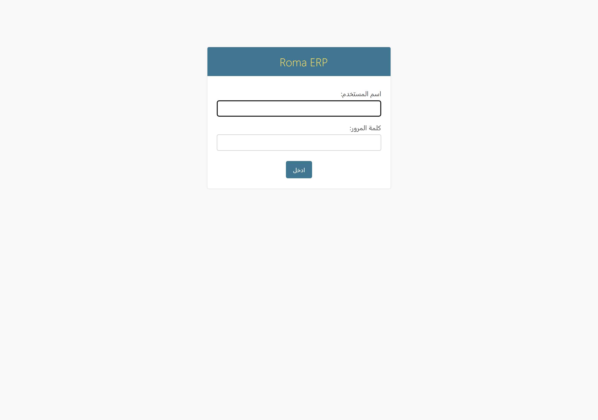

> **مهم:** الباسورد بتاعك سرّي. متكتبهوش لحد، ولو حسّيت إن حد عرفه قول للمدير يغيّره.

> **لو الشاشة قالت "اسم المستخدم أو كلمة السر غلط":** غالباً فيه حرف غلط، أو الـ Caps Lock مفعّل (بيكتب كابيتال). راجع وحاول تاني.

---

## 0.3 شكل الشاشة بعد ما تدخل

بعد ما تدخل هتلاقي الشاشة مقسّمة جزئين:

- **على اليمين (القائمة الجانبية / Sidebar):** ليستة بكل أقسام السيستم. دي اللي بتتنقل بيها بين الشاشات.
- **النص (مساحة الشغل):** هنا بتظهر البيانات والجداول والخانات اللي بتملاها.

القائمة الجانبية مقسّمة لمجموعات، كل مجموعة جواها شاشات:

| المجموعة | الشاشات اللي جواها | بتستخدمها في إيه |
|---|---|---|
| **CORE** | بيانات الشركة · دليل الحسابات · قيود اليومية | الإعدادات الأساسية والمحاسبة (غالباً المدير بس) |
| **INVENTORY** | المنتجات · المنتجات الفرعية · الـ SKUs · حركات المخزون | المنتجات الرئيسية والفرعية والمخزن |
| **SALES** | العملاء · سندات القبض · فواتير المبيعات · مرتجعات المبيعات | كل حاجة ليها علاقة بالبيع |
| **الخزينة والمصروفات** | حسابات النقدية والبنوك والمحافظ · سندات صرف المصروفات · بنود المصروفات · الأصول الثابتة | إدارة الخزن والبنوك والمحافظ، وتسجيل المصروفات والأصول |
| **PURCHASE** | أنواع الموردين · الموردين · مشتريات القماش · مشتريات الإكسسوارات · سندات دفع للموردين | كل حاجة ليها علاقة بالشراء |
| **إدارة المصنع** | ألوان القماش · أنواع القماش · أوامر الإنتاج · الإكسسوارات · المقاسات · حركات القماش · ملاحظات المنتج | التصنيع |

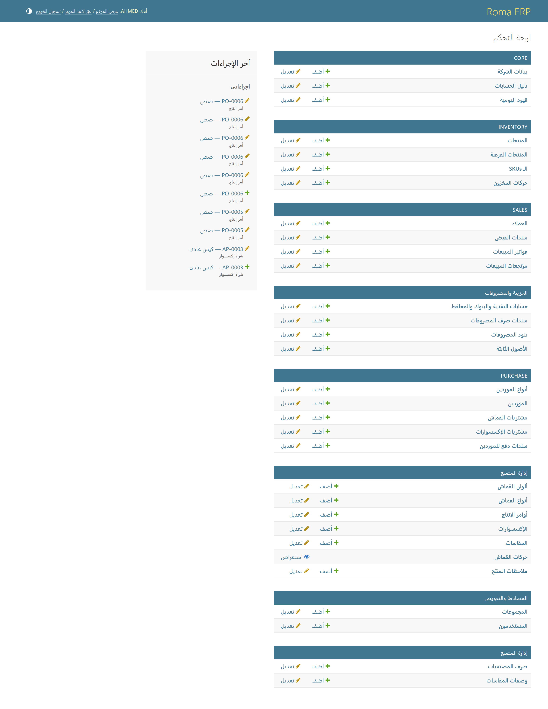

> **مش لازم تستخدم كل الشاشات.** كل موظف بيشتغل على القسم بتاعه بس. اللي في المبيعات يركّز على SALES، واللي في المخزن على INVENTORY، وهكذا.

### لوحة المؤشرات (الصفحة الرئيسية)

فيه كمان **لوحة مؤشرات** مرئية بتلخّصلك حالة الشركة في نظرة واحدة. توصلها من العنوان الأساسي للسيستم (مثلاً `http://localhost:8001/`). فيها:

- **كروت أرقام فوق:** مبيعات اليوم، مبيعات الشهر، **مبيعات العام**، النقدية، رصيد البنك، المستحق من العملاء، قيمة المخزون، الأصناف المنخفضة، والفواتير المتأخرة.
- **كل الموديولات والإجراءات السريعة في مكان واحد** — تقدر تفتح أي شاشة أو تضيف سجل جديد منها على طول من غير تكرار.
- **مخططات بيانية:** المبيعات الشهرية، أعمار الذمم، أعلى العملاء والموديلات.
- **زر طباعة إجمالي الأداء** اللي بيطبع 4 تقارير في وثيقة واحدة، وكروت لكل التقارير المالية والتشغيلية.

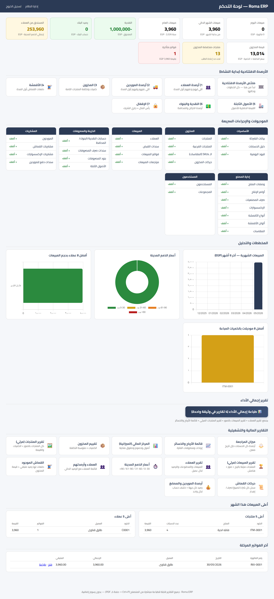

---

## 0.4 الأزرار والكلمات اللي هتقابلك في كل شاشة (احفظها)

الشاشات كلها بتشتغل بنفس الطريقة، فلو فهمت الأزرار دي مرة، هتعرف تستخدم أي شاشة:

- **زر "إضافة ➕ / Add":** فوق على الشمال. بيفتحلك صفحة فاضية تكتب فيها سجل جديد (عميل جديد، فاتورة جديدة...).
- **زر "حفظ / Save":** تحت في الصفحة. بيحفظ اللي كتبته. **من غير حفظ، اللي كتبته بيضيع.**
- **"حفظ وإضافة آخر":** بيحفظ ويفتحلك فاضية تكتب واحد تاني بسرعة.
- **"حفظ والاستمرار في التعديل":** بيحفظ ويسيبك في نفس الصفحة عشان تكمّل.
- **خانة البحث 🔍:** فوق الجدول. اكتب فيها اسم أو رقم وادوس Enter عشان تلاقي سجل بسرعة.
- **الفلاتر (على الشمال جنب الجدول):** بتقلّل اللي ظاهر قدامك (مثلاً تشوف فواتير شهر معيّن بس).
- **الخانة اللي عليها نجمة أو مكتوب جنبها (إجباري):** لازم تملاها، السيستم مش هيحفظ من غيرها.

> **قاعدة ذهبية:** أي حاجة بتكتبها مش بتأثر على حاجة لحد ما تدوس **حفظ**.

---

## 0.5 أهم مفهوم في السيستم كله: "مسوّدة" و "مُرحّل"

ده أهم جزء في الدليل. اقراه مرتين.

أغلب المستندات (الفواتير، السندات، المشتريات، أوامر الإنتاج) بتعدّي على **مرحلتين**:

### المرحلة الأولى: مسوّدة (Draft)
- ده وانت لسه بتكتب وتجهّز المستند.
- تقدر تعدّل فيه، تمسح، تزوّد، تنقّص — **براحتك**.
- **مهم جداً:** وهو مسوّدة، **مش بيأثر على أي حاجة**. المخزن زي ما هو، حساب العميل زي ما هو، مفيش قيود اتكتبت. كإنه ورقة في إيدك بتسوّد فيها.

### المرحلة الثانية: مُرحّل (Posted)
- بعد ما تراجع وتتأكد إن كل حاجة صح، بتدوس زر **الترحيل** (Post).
- ساعتها السيستم بيعمل كل حاجة "للحقيقي": يخصم المخزن، يحدّث حساب العميل، يكتب القيود.
- **وبعد الترحيل بيتقفل المستند** فمتقدرش تعدّله. (لو فيه غلط، فيه زر إلغاء بيعكس العملية).

> ### اعتبرها كده:
> - **مسوّدة** = بتكتب الشيك بقلم رصاص، تقدر تمسح.
> - **ترحيل** = ختمته وسلّمته، خلاص بقى رسمي.

> **النصيحة:** راجع كله وانت لسه مسوّدة. لما تطمن، ادوس ترحيل. مفيش عجلة.

---

## 0.6 الأرقام والكسور

كل الأرقام في السيستم بتظهر بالشكل ده:

**`5,500.00`**

- الفاصلة `,` بتفصل الآلاف (يعني خمسة آلاف وخمسمية).
- النقطة `.` للقروش/الكسور (يعني `.00` معناها مفيش قروش، و `.50` نص جنيه).

مثال: `12,750.25` معناها اتناشر ألف وسبعمية وخمسين جنيه و25 قرش.

---

## 0.7 الخانات اللي بتتملي لوحدها (متلمسهاش)

فيه خانات السيستم بيحسبها أو بيكتبها لوحده، **سيبها فاضية وانت بتضيف جديد**:
- **أرقام المستندات:** رقم الفاتورة، كود العميل، رقم الأمر... بتتولّد تلقائياً عند الحفظ (مثلاً العميل بياخد كود `C0001`).
- **الإجماليات:** مجموع الفاتورة، الرصيد، التكلفة... السيستم بيجمعها لوحده.
- **الخانات المكتوب عليها "للقراءة فقط":** دي بتتعرض بس، متتكتبش.

> لو حاولت تكتب في خانة محسوبة، يا إما مش هتعرف، يا إما السيستم هيتجاهل اللي كتبته ويحسب الصح.

---

## 0.8 إزاي تبدأ يومك على السيستم (روتين سريع)

1. افتح المتصفح وادخل (Login).
2. روح على القسم بتاعك من القائمة الجانبية.
3. اعمل شغل اليوم: فواتير، تحصيلات، إدخال مخزن... إلخ.
4. أي مستند مهم، **راجعه وهو مسوّدة الأول، وبعدين رحّله**.
5. آخر اليوم، لو محتاج، اطبع اللي محتاج تطبعه.

دلوقتي يلا نبدأ ندخل على الشاشات واحدة واحدة. 👇

---

# قسم INVENTORY (المخزون)

> القسم ده بتعرّف فيه السيستم على المنتجات اللي بتبيعها، وبيتابع الكميات في المخزن.

## 1. المنتجات والمنتجات الفرعية

> ⚠️ **طريقة تعريف المنتجات بقت على مستويين** — خد بالك من ده كويس:
> 1. **المنتج الرئيسي** = الموديل الأساسي وكل «عقله»: نوع القماش، عدد القطع في الدستة، نسبة الهالك، والوصفة لكل مقاس (كمية القماش + المصنعية + سعر البيع + الإكسسوارات).
> 2. **المنتج الفرعي** = الإصدار اللي بتبيعه فعلاً (لون معيّن) = اسم + **لون قماش** + صورة بس. كل الباقي بيرثه من المنتج الرئيسي تلقائياً.
>
> **ليه اتقسمت؟** عشان لو عندك نفس الموديل بـ 5 ألوان، تعرّف الوصفة والسعر **مرة واحدة** على المنتج الرئيسي، وتعمل 5 منتجات فرعية (لون لكل واحد) من غير ما تعيد إدخال أي تكلفة أو سعر.

### 1-أ) المنتج الرئيسي (الموديل + الوصفة + السعر)

**يعني إيه؟** ده «المخ» اللي بيحدد كل حاجة عن الموديل: الخامة، المقاسات، التكلفة، والسعر. **المنتج الرئيسي لوحده ما بيتباعش** — اللي بيتباع هو المنتجات الفرعية التابعة له.

#### الخطوات:
1. من القائمة الجانبية دوس **المنتجات**. هتظهر ليستة بكل الموديلات الأساسية.
2. دوس **إضافة منتج** (فوق على الشمال). املأ:
   - **اسم المنتج** (إجباري) — مثلاً «تيشرت قطن رجالي».
   - **الاسم بالإنجليزي / الفئة** (اختياري).
   - **نوع القماش/الخامة** — اختار نوع القماش اللي بيتصنّع منه الموديل (من كتالوج «أنواع الأقمشة»). ده اللي هيتخصم من مخزون القماش وقت الإنتاج.
   - **عدد القطع في الدستة** (افتراضياً 12).
   > **يعني إيه دستة؟** الدستة وحدة بيع جملة = مجموعة قطع مع بعض. **النظام كله بيشتغل بالدستة**، فالكميات في الفواتير والتقارير بتتحسب دستات.
   - **نسبة الهالك %** — الزيادة على القماش بسبب الهالك (مثلاً 5 = الكمية بالهالك = الكمية قبل الهالك × 1.05). **بتتحسب على المنتج كله مش لكل مقاس.**
   - **نشط** — سيبها متعلّمة (✓).
3. **تحت في جدول «الوصفة لكل مقاس»** — ده أهم جزء. ضيف **سطر لكل مقاس** بتنتجه، وفي كل سطر:
   - **المقاس** (S, M, L...).
   - **كمية القماش بالكيلو** للقطعة الواحدة في المقاس ده (قبل الهالك).
   - **المصنعية** للقطعة الواحدة.
   - **سعر البيع** للقطعة — والسيستم بيحسب سعر الدستة لوحده.
   - **حد إعادة الطلب** (لما المخزون ينزل تحته يبقى لازم تنتج تاني).
   - **«إكسسوارات المقاس»** — احفظ الأول، وبعدين من اللينك ده ضيف إكسسوارات المقاس (زراير، أكياس...) والكمية لكل قطعة.
4. دوس **حفظ**.

> **مهم:** التكلفة والسعر والمقاسات كلها بتتعرّف هنا على المنتج الرئيسي **مرة واحدة**، وكل المنتجات الفرعية التابعة له بتاخدها تلقائياً.

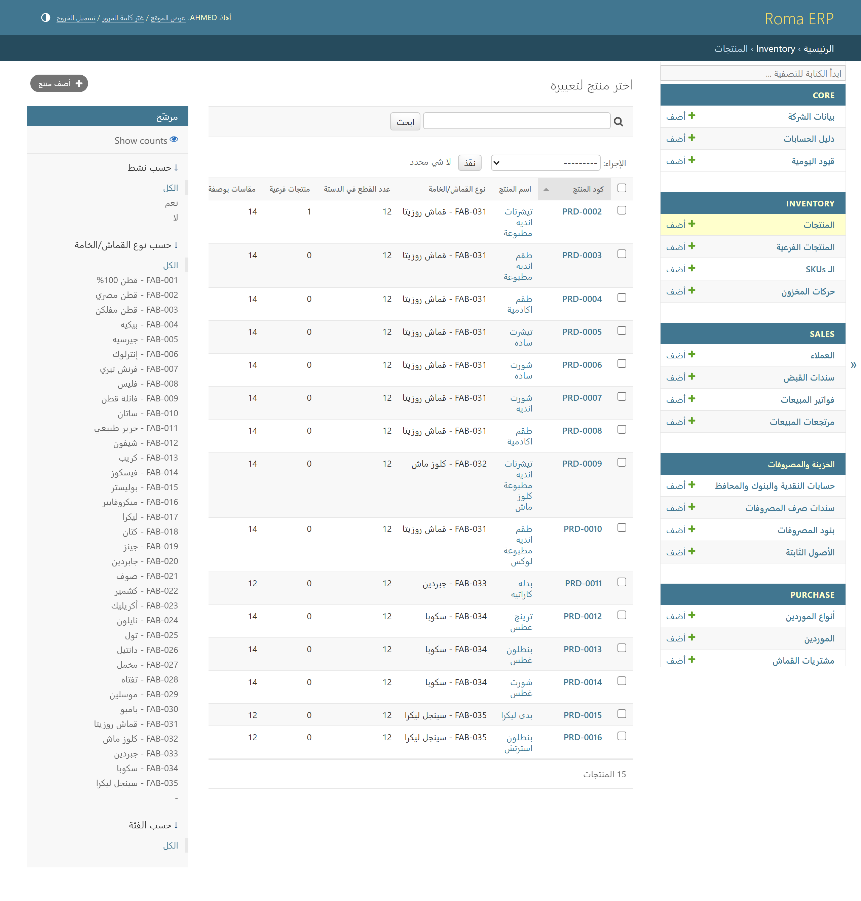

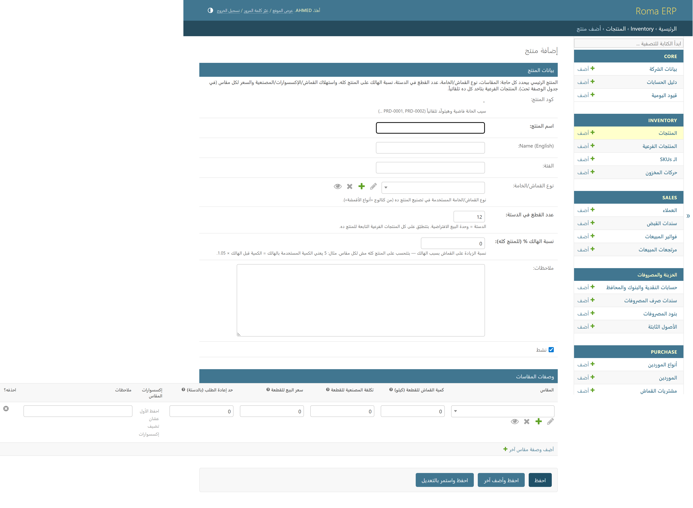

### 1-ب) المنتج الفرعي (الإصدار القابل للبيع)

**يعني إيه؟** ده اللي بتبيعه فعلاً — إصدار/لون من المنتج الرئيسي. مثلاً المنتج الرئيسي «تيشرت قطن رجالي» ليه منتجات فرعية: «تيشرت قطن رجالي أحمر»، «... أزرق»، وهكذا.

**بياخد إيه من المنتج الرئيسي؟** المقاسات، الأسعار، الوصفة (قماش/إكسسوارات/مصنعية)، عدد القطع في الدستة — كله تلقائياً. **انت بس بتحدد:** الاسم، **لون القماش**، والصورة.

#### الخطوات:
1. من القائمة الجانبية دوس **المنتجات الفرعية**. هتظهر ليستة بكل الإصدارات.
2. دوس **إضافة منتج فرعي**. املأ:
   - **المنتج الرئيسي** (إجباري) — اختار الموديل الأساسي اللي ده تابع له. أول ما تختاره وتحفظ، السيستم هيجيب منه المقاسات والأسعار والوصفة.
   - **الاسم** (إجباري) — اسم الإصدار زي ما بتناديه (يُفضّل تكتب اللون في الاسم).
   - **لون القماش المستخدم** (مهم جداً ⚠️) — اللون اللي هيتخصم من **مخزون القماش** وقت الإنتاج. المخزون متخزّن **باللون**، فلازم تختار اللون الصح عشان الخصم يبقى من نفس اللون. لو اخترت لون غلط، هيتخصم من رصيد لون تاني.
   - **نشط** — سيبها متعلّمة (✓).
3. **«بيتورّث من المنتج الرئيسي»** — صندوق للعرض بس بيوريك نوع القماش وعدد القطع في الدستة وعدد المقاسات اللي هتتولّد. مش بتكتب فيه حاجة.
4. **قسم الصورة:** دوس «اختيار ملف» وحدّد صورة المنتج (بتظهر في التقارير والفواتير).
5. دوس **حفظ**. بعد الحفظ، السيستم بيولّد **SKU لكل مقاس** تلقائياً (بتظهر تحت كجدول للعرض فقط).

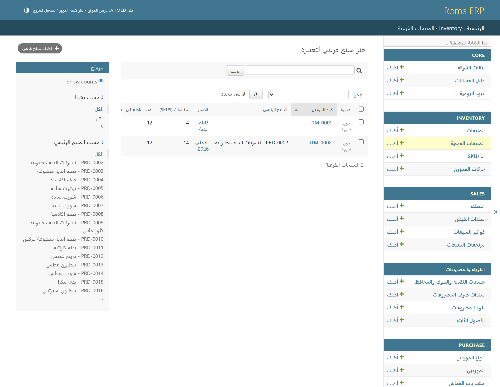

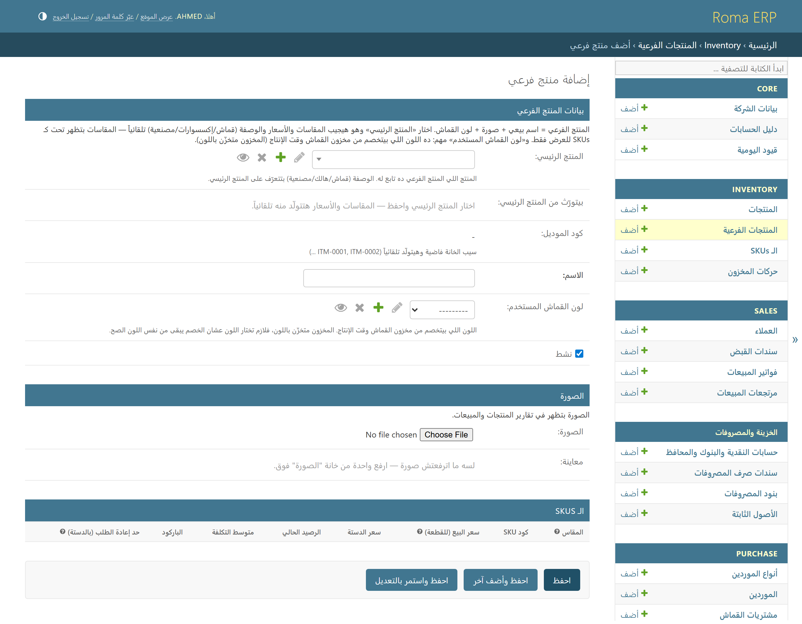

> **خطأ شائع:** نسيان **لون القماش المستخدم**. من غيره الإنتاج مش هيعرف يخصم من أنهي رصيد لون.

> **معلومة:** الأسعار والمقاسات مش بتتعدّل هنا — لو عايز تغيّر سعر أو تضيف مقاس، ده بيتم على **وصفة المنتج الرئيسي** (خطوة 1-أ)، وكل المنتجات الفرعية هتتحدّث تلقائياً.

---

## 2. الـ SKUs (مقاسات المنتجات)

**يعني إيه SKU؟** كلمة معناها "منتج بمقاس محدد". يعني "تيشرت قطن أحمر" ده منتج فرعي، لكن "تيشرت قطن أحمر - مقاس L" ده SKU. كل مقاس ليه SKU لوحده، وعشان كده ليه مخزون وتكلفة لوحده.

**منين بتيجي؟** الـ SKUs **بتتولّد لوحدها** أول ما تحفظ المنتج الفرعي — سطر لكل مقاس موجود في وصفة المنتج الرئيسي. **مش محتاج تضيفها بإيدك.**

### الخطوات (للاطلاع غالباً):
1. دوس **الـ SKUs** من القائمة. هتشوف ليستة كل مقاسات كل المنتجات الفرعية.
2. **سعر البيع** بييجي من وصفة المنتج الرئيسي (للقراءة فقط هنا) — لو عايز تغيّره، غيّره على الوصفة.
3. خانات **الكود** و**المخزون الحالي** و**متوسط التكلفة** كمان للقراءة فقط — بتتحدّث لوحدها مع الفواتير والإنتاج.

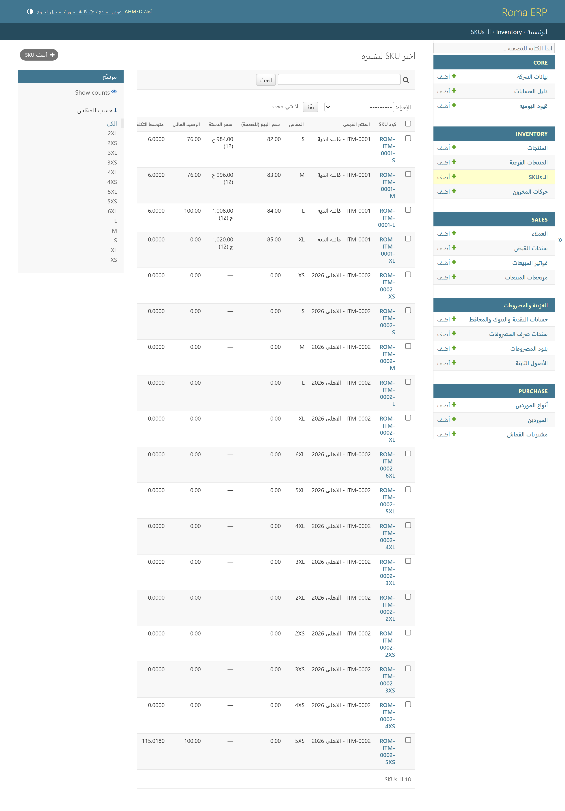

---

## 3. حركات المخزون (شاشة للاطلاع فقط)

**يعني إيه؟** ده سجل بيكتب فيه السيستم **كل** دخول وخروج للمخزن: كل بيع (خروج)، كل إنتاج (دخول)، كل مرتجع (دخول). زي كشف حساب بس للبضاعة.

**مهم تفهم:** الشاشة دي **للقراءة بس**. متقدرش تكتب فيها بإيدك، وده مقصود — عشان السجل يفضل صح ومحدش يعبث فيه. بتتولّد لوحدها كل ما تعمل فاتورة أو إنتاج.

### الخطوات:
1. دوس **حركات المخزون**.
2. تقدر تفلتر بالتاريخ أو نوع الحركة عشان تلاقي حاجة معيّنة.

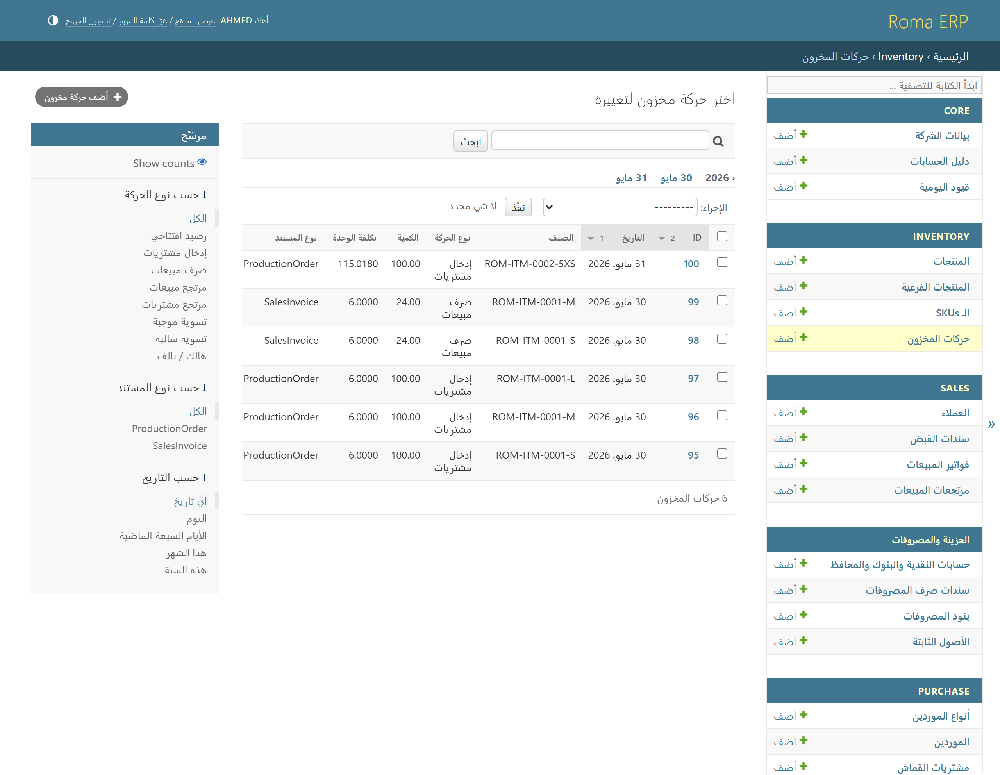

> **بتستخدمها امتى؟** لما تحب تتأكد ليه مخزون منتج بقى الرقم ده، فتشوف كل الحركات اللي حصلتله.

---

# قسم SALES (المبيعات)

> ده القسم اللي بيشتغل عليه موظف المبيعات أغلب اليوم.

## 4. العملاء

**الغرض:** تسجّل بيانات كل عميل مرة واحدة، وبعدين السيستم يتابع رصيده (هو مدين لك بكام).

### الخطوات:
1. دوس **العملاء** ← **إضافة عميل**.
2. املأ:
   - **الاسم بالعربي** (إجباري).
   - **التليفون** و**المحافظة**.
   - **مدة السداد (بالأيام)** — كام يوم مسموح للعميل ياخدهم قبل ما يدفع. (مثلاً 30 يوم).
   - **حد الائتمان** — أقصى مبلغ مسموح للعميل يكون مدين بيه. لو وصله، السيستم هينبّهك.
3. دوس **حفظ**. (كود العميل بيتولّد تلقائياً زي `C0001`).
4. في ليستة العملاء:
   - عمود **الرصيد الحالي** بيوريك العميل مدين لك بكام.
   - زر **كشف حساب** بيفتحلك كل حركات العميل (فواتيره ودفعاته).

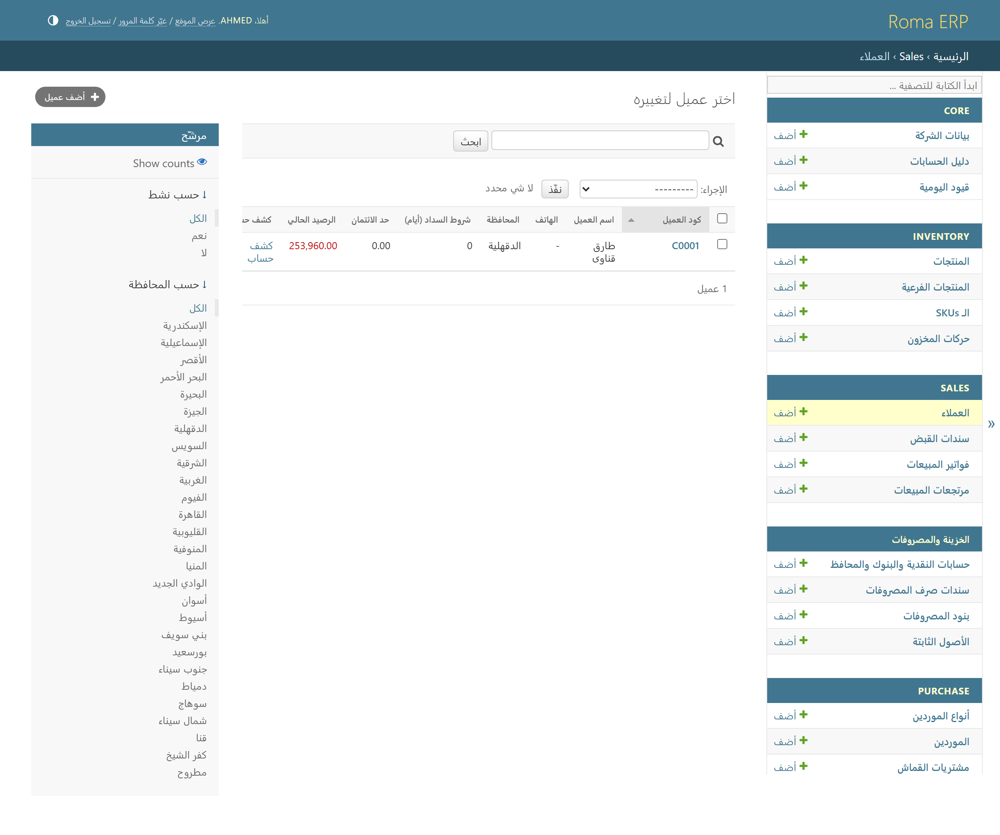

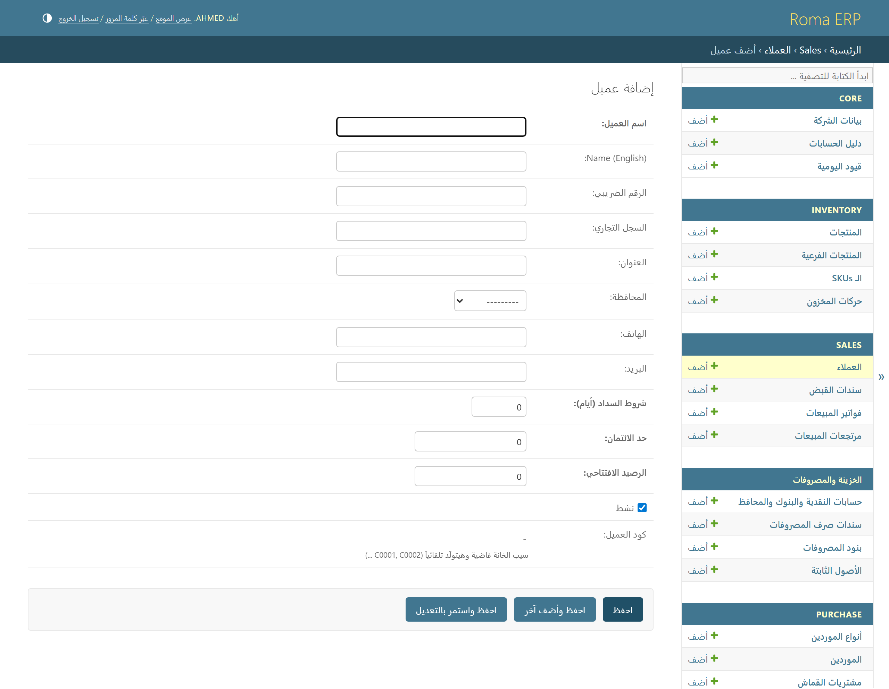

> **يعني إيه رصيد؟** الرصيد = الفلوس اللي للعميل عليها (مديونيته). لما تبيعله بياخد فاتورة فرصيده بيزيد، ولما يدفع بينزل.

---

## 5. فواتير المبيعات

**الغرض:** تسجّل عملية بيع لعميل. لما ترحّلها، السيستم بيخصم المخزن ويزوّد مديونية العميل ويكتب القيد المحاسبي.

### الخطوات:
1. دوس **فواتير المبيعات** ← **إضافة فاتورة**.
2. اختار **العميل** و**التاريخ**.
3. (اختياري) لو فيه خصم على الفاتورة كلها: اكتب **نسبة الخصم %** أو **مبلغ الخصم**. ولو الدفع جزء كاش وجزء آجل، حدّد ده.
4. **في جدول البنود تحت** (ده قلب الفاتورة): ضيف سطر لكل منتج بتبيعه:
   - اختار **المنتج** بالاسم.
   - اختار **المقاس** — هتلاحظ إن القائمة بتوريك مقاسات المنتج اللي اخترته بس (السيستم بيفلتر لوحده).
   - اكتب **الكمية**.
   - **السعر** بيظهر لوحده من بيانات المنتج (تقدر تعدّله لو فيه اتفاق خاص).
   - عايز منتج تاني؟ ضيف سطر جديد.
5. دوس **حفظ**. هتفضل في صفحة الفاتورة وتشوف الإجماليات اتحسبت تحت.
6. **راجع الفاتورة كويس** (العميل صح؟ الكميات صح؟ الأسعار صح؟).
7. لما تتأكد، دوس زر **ترحيل الفاتورة** (الأخضر).

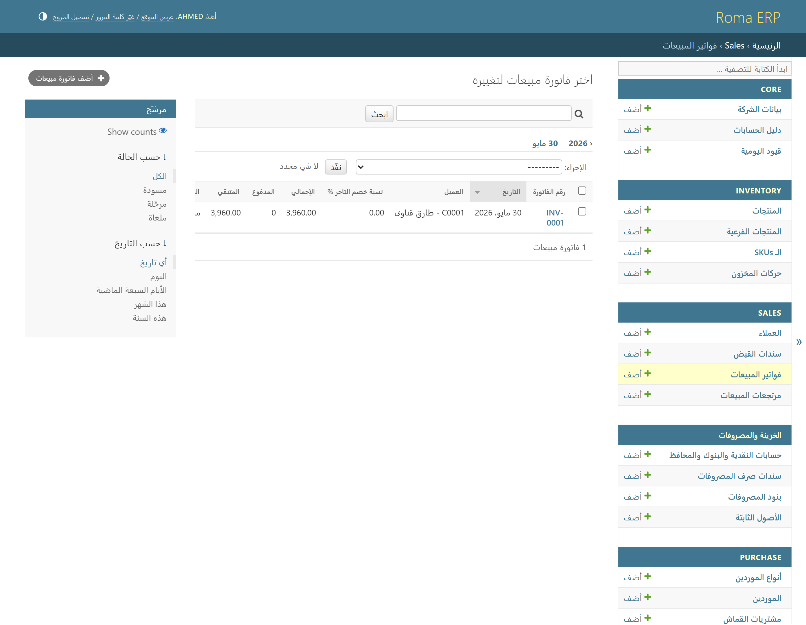

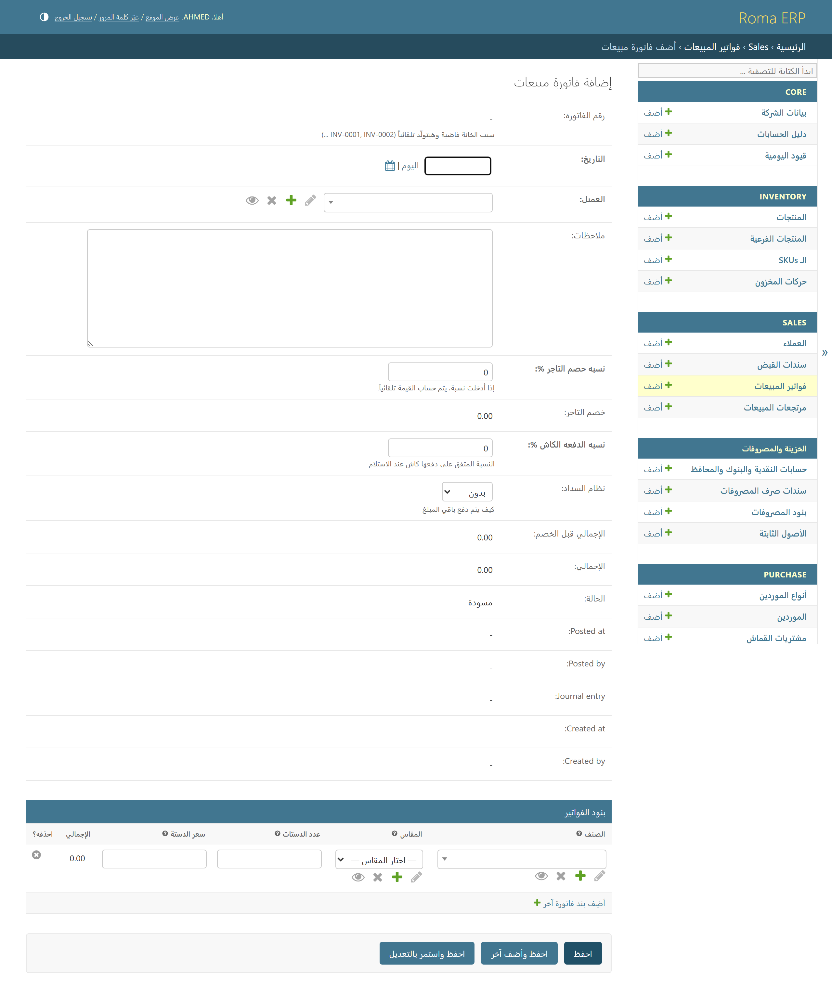

> بعد الترحيل: المخزن بيتخصم منه الكميات، حساب العميل بيزيد، القيد بيتعمل، والفاتورة بتتقفل.

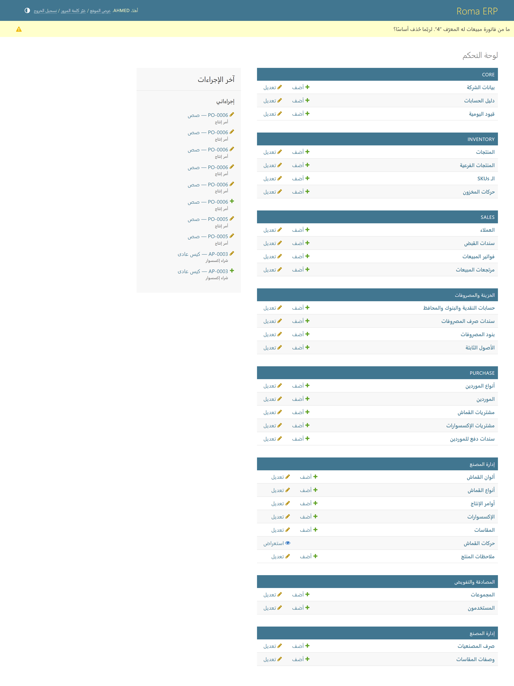

8. **للطباعة:** دوس زر **🖨️ طباعة** (فيه نسخة "أصل" للعميل ونسخة "صورة" تحتفظ بيها). الفاتورة بتطلع بالدستات وسعر الدستة والإجمالي ورصيد العميل.

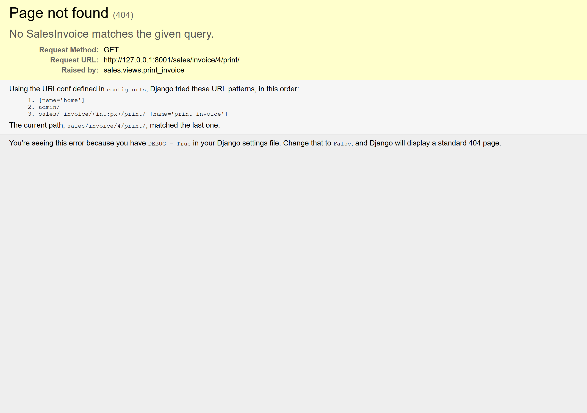

9. **لو اكتشفت غلط بعد الترحيل:** فيه زر **إلغاء الفاتورة** بيعكس كل حاجة (يرجّع المخزن ويلغي القيد). استخدمه بحرص.

> **خطأ شائع:** الترحيل قبل المراجعة. خد دقيقة راجع البنود قبل ما تدوس ترحيل، لأن بعد كده محتاج إلغاء وإعادة.

---

## 6. سندات القبض (تحصيل فلوس من العملاء)

**يعني إيه سند قبض؟** ورقة بتثبت إنك **قبضت** (استلمت) فلوس من عميل. وبتخصم المبلغ من مديونيته.

### الخطوات:
1. دوس **سندات القبض** ← **إضافة سند قبض**.
2. اختار **العميل**، **التاريخ**، **طريقة الدفع** (كاش / تحويل بنكي / شيك)، و**المبلغ** اللي استلمته.
3. (اختياري لكن مفيد) في جدول **التخصيصات** تحت: اربط المبلغ بفاتورة معيّنة أو أكتر. (القائمة بتوريك فواتير العميل المرحّلة بس). ده بيقولك "الفلوس دي سداد لأنهي فاتورة".
4. دوس **حفظ**.
5. راجع، وبعدين دوس **ترحيل سند القبض** — رصيد العميل (مديونيته) هينزل بالمبلغ.
6. دوس **🖨️ طباعة** عشان تطبع السند وتديله للعميل كإيصال.

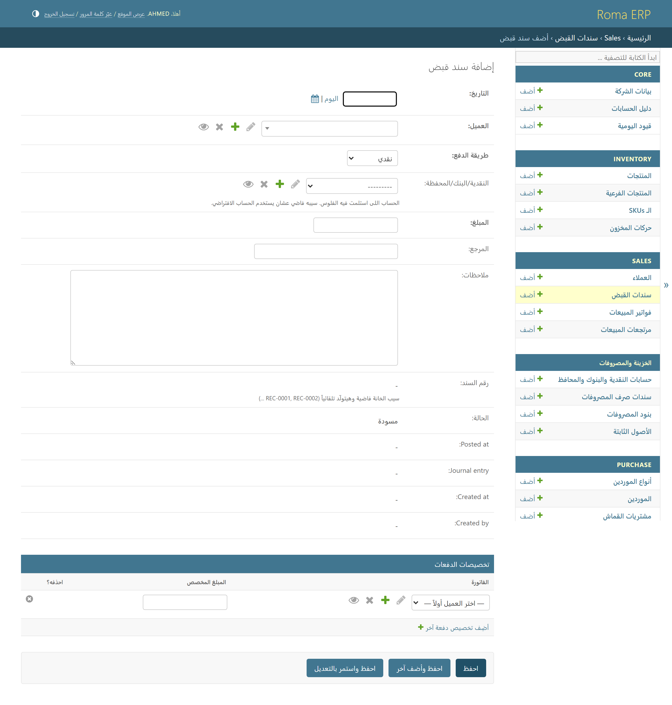

---

## 7. مرتجعات المبيعات

**يعني إيه؟** لما عميل يرجّعلك بضاعة (مقاس غلط، عيب...)، بتسجّل المرتجع. ساعتها البضاعة بترجع المخزن وقيمتها بتتشال من حساب العميل.

### الخطوات:
1. دوس **مرتجعات المبيعات** ← **إضافة مرتجع**.
2. اختار **العميل**، و(لو معروفة) **الفاتورة الأصلية** اللي البضاعة اتباعت فيها.
3. **طريقة سريعة لو راجع كله:** بعد ما تختار الفاتورة الأصلية وتحفظ، هيظهر زر **نسخ البنود من الفاتورة** — بيجيب كل بنود الفاتورة كمرتجع جاهز، وانت بعدين تمسح السطور اللي مرجعتش.
4. أو ضيف البنود يدوي في الجدول (المنتج + المقاس + الكمية + السعر).
5. اكتب **سبب الإرجاع** (مهم للمتابعة).
6. دوس **حفظ**، راجع، وبعدين **ترحيل المرتجع** — البضاعة ترجع المخزن والقيمة تتعكس من حساب العميل.

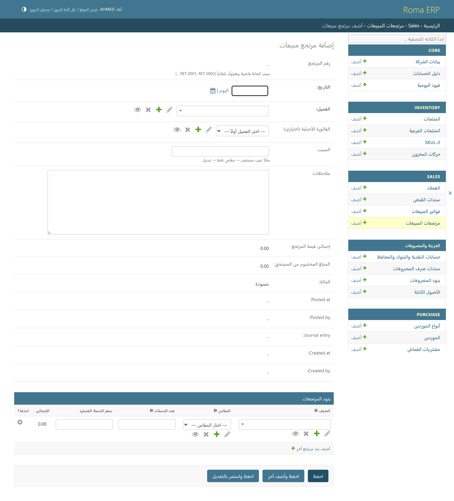

---

# قسم الخزينة والمصروفات

> القسم ده بتدير منه فلوسك (الخزن والبنوك والمحافظ)، وبتسجّل مصروفات الشركة وأصولها الثابتة.

## الخزينة: حسابات النقدية والبنوك والمحافظ

**الغرض:** تقدر تكون عندك **أكتر من حساب فلوس** — صندوق كاش، حساب في بنك مصر، حساب في البنك الأهلي، محفظة فودافون كاش... وكل حركة قبض أو دفع أو مصروف بتختار منها فلوسها طلعت أو دخلت في أنهي حساب.

### الخطوات:
1. من مجموعة **الخزينة والمصروفات** دوس **حسابات النقدية والبنوك والمحافظ** ← **إضافة**.
2. املأ:
   - **اسم الحساب** (مثلاً "صندوق المحل" أو "بنك مصر - فرع وسط البلد").
   - **النوع:** نقدية (خزنة) / بنك / محفظة إلكترونية.
   - **رقم الحساب أو مزود المحفظة** (اختياري).
   - **حساب دليل الحسابات المرتبط** — الحساب المحاسبي اللي الفلوس بتتسجّل فيه.
3. دوس **حفظ**.
4. السيستم بيبدأ بحسابين جاهزين: **الصندوق** و**البنك**. زوّد عليهم اللي انت محتاجه.

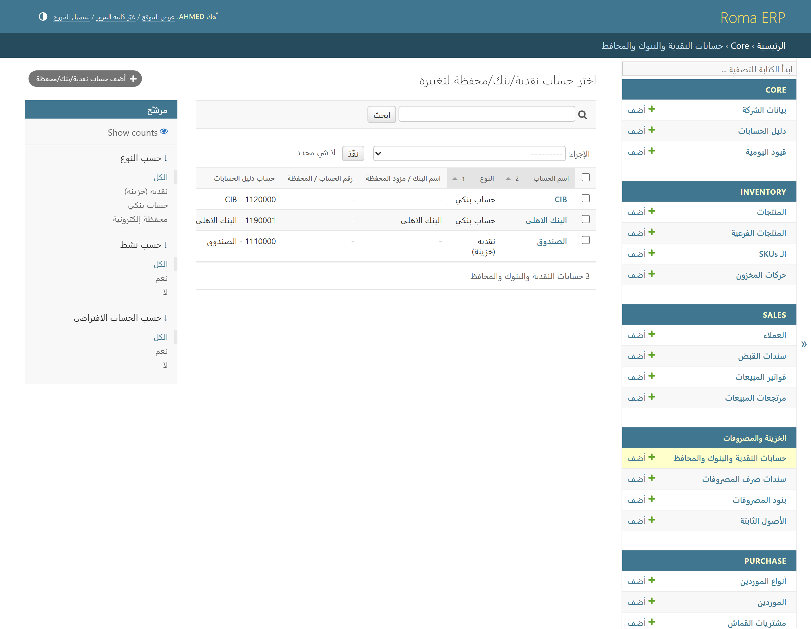

> **بتستخدمها امتى؟** في سند القبض، سند الدفع، المصروف، ومشتريات الإكسسوارات — هتلاقي خانة **مدفوع من / استلمت في** بتختار منها الحساب. سيبها فاضية عشان تستخدم الحساب الافتراضي.

---

## سندات صرف المصروفات

**يعني إيه؟** أي فلوس بتطلع من الشركة مش شراء بضاعة — **مرتبات، إيجار، صيانة، مواصلات، كهربا...** — بتسجّلها هنا كسند مصروف.

### الخطوات:
1. دوس **سندات صرف المصروفات** ← **إضافة**.
2. املأ:
   - **التاريخ**.
   - **بند المصروف** (مرتبات / إيجار / صيانة...). السيستم بيبدأ ببنود جاهزة، وتقدر تزوّد بزر ➕.
   - **البيان** (تفاصيل المصروف — مثلاً "مرتب شهر 5").
   - **المبلغ**.
   - **مدفوع من** — اختار حساب النقدية/البنك/المحفظة اللي الفلوس طلعت منه.
   - **مرجع** و**ملاحظات** (اختياري).
3. دوس **حفظ** (لسه مسوّدة)، راجع، وبعدين **ترحيل** — السيستم بيخصم الفلوس من الحساب ويكتب القيد.

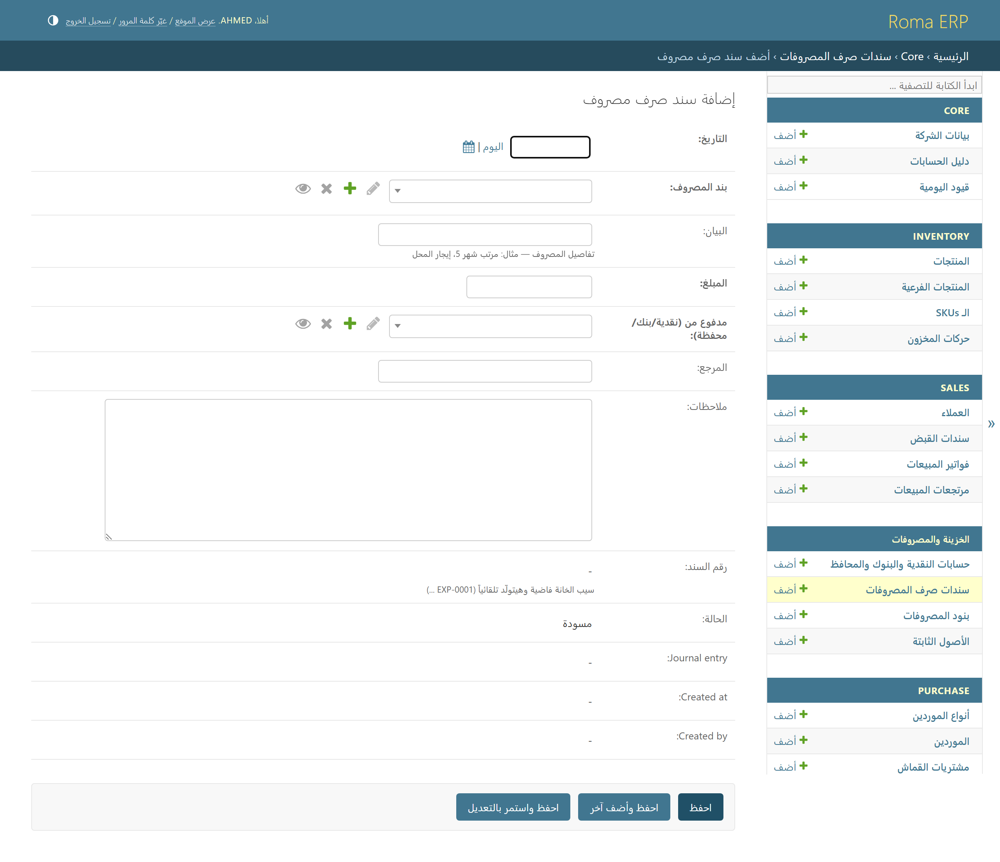

> **بنود المصروفات:** فيه شاشة لوحدها لإدارة بنود المصروفات (تضيف أو تعدّل بند). هتلاقيها في نفس المجموعة.

---

## سجل الأصول الثابتة

**يعني إيه أصل ثابت؟** حاجة بتشتريها للشركة وبتفضل معاك سنين — **مكنة، عربية، أوضة كمبيوتر، أثاث...** مش بضاعة بتتباع. الشاشة دي بتسجّلها وتحتفظ بسجل بيها.

### الخطوات:
1. دوس **الأصول الثابتة** ← **إضافة**.
2. املأ:
   - **اسم الأصل** (مثلاً "ماكينة أوفر لوك").
   - **الفئة** (آلات ومعدات / سيارات نقل / أثاث...).
   - **تاريخ الشراء** و**التكلفة**.
   - **طريقة الدفع** و**مدفوع من** (الحساب اللي دفعت منه) **أو المورد** (لو آجل).
   - **الرقم التسلسلي** و**المكان** و**ملاحظات** (اختياري).
3. دوس **حفظ**، راجع، وبعدين **ترحيل** — بيتسجّل الأصل ويتكتب القيد المحاسبي.

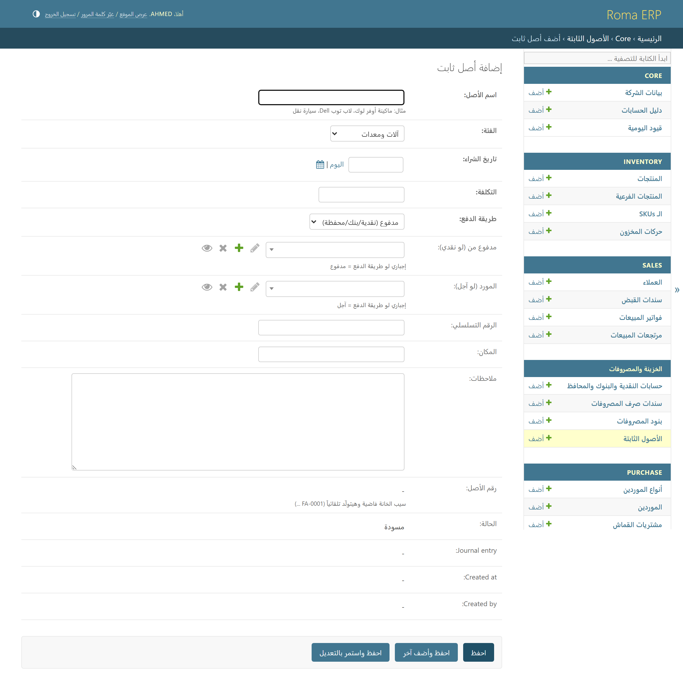

> **ملاحظة:** السيستم بيسجّل شراء الأصل بس (مفيش حسابات إهلاك). الغرض إنه يبقى عندك **سجل** بكل أصول الشركة وقيمتها.

---

# قسم PURCHASE (المشتريات والموردين)

> القسم ده بتسجّل فيه اللي بتشتريه واللي بتدفعه للموردين.

## 8. أنواع الموردين

**ليه بنصنّف الموردين؟** عشان عندك أنواع مختلفة: مورد قماش، مصبغة، مورد إكسسوارات، صاحب مكنة... كل نوع بيظهر في الشاشة المناسبة بس، فبيريّحك من اللخبطة.

### الخطوات:
1. دوس **أنواع الموردين** ← **إضافة**.
2. اكتب **الاسم بالعربي** (مثلاً "مورد قماش") و**ترتيب الظهور** (رقم بيرتّب اللي يظهر الأول).
3. دوس **حفظ**.

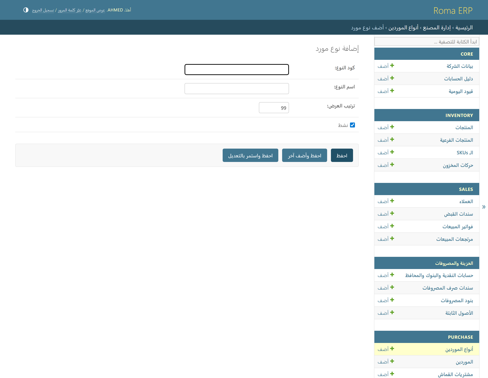

> **تعمل ده امتى؟** مرة واحدة في الأول، وقت تجهيز السيستم. بعد كده نادراً ما تضيف نوع جديد.

---

## 9. الموردين

**الغرض:** تسجّل بيانات كل مورد، والسيستم يتابع رصيده (احنا مدينين له بكام).

### الخطوات:
1. دوس **الموردين** ← **إضافة مورد**.
2. املأ:
   - **الاسم** (إجباري).
   - **نوع المورد** (إجباري — من اللي عملناه في خطوة 8).
   - **التليفون** و**العنوان** و**الرقم الضريبي** (اختياري).
3. دوس **حفظ**.
4. في الليستة:
   - عمود **الرصيد الحالي** بيوري احنا مدينين للمورد بكام.
   - زر **💰 ادفع** بيفتحلك سند دفع جاهز للمورد ده على طول.
   - زر **كشف حساب** بيوري كل تعاملاتك معاه.

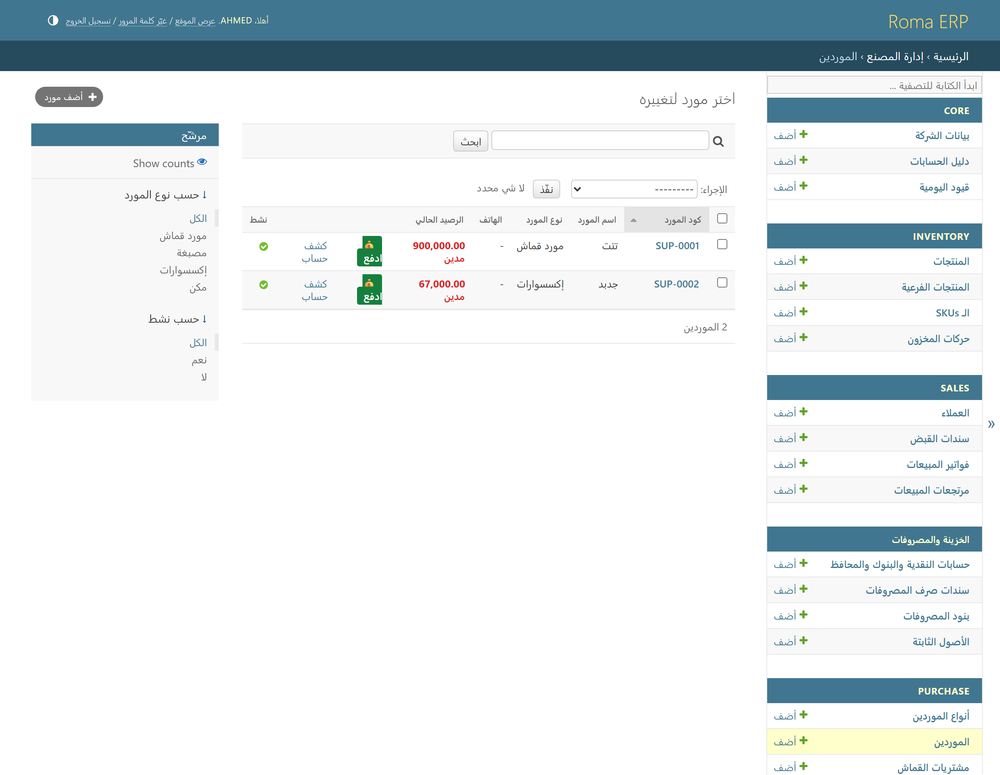

---

## 10. مشتريات القماش (الشراء)

**الغرض:** تسجّل شراء دفعة (شحنة) قماش من مورد. لما ترحّلها، القماش بيتزوّد في المخزن وبيتكتب القيد المحاسبي.

### الخطوات:
1. دوس **مشتريات القماش** ← **إضافة**.
2. في **بيانات الشراء**: اختار **المورد**، **نوع القماش**، **اللون**، و**تاريخ الشراء**.
3. في **السعر والكمية**:
   - **الكمية بالكيلو** اللي اشتريتها.
   - **تكلفة الوحدة** = سعر الكيلو الواحد.
   - **طريقة الدفع** (كاش / آجل). "آجل" يعني هتدفع بعدين، فبيزيد رصيد المورد.
   - **إجمالي الشراء** بيتحسب لوحده (الكيلو × سعر الكيلو).
4. دوس **حفظ** (لسه مسوّدة — مفيش حاجة اتحركت).
5. راجع، وبعدين دوس **حفظ وترحيل** — هيضيف القماش لمخزن الأقمشة ويعمل القيد ويقفل العملية.

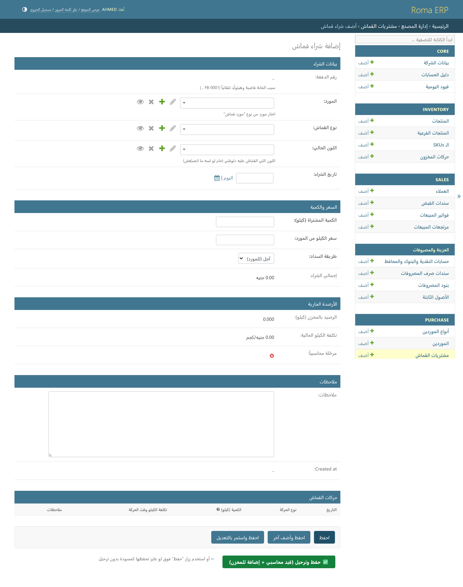

> بعد الترحيل، الدفعة دي بتظهر في **حركات القماش** وبتزود **مخزون القماش**.

---

## مشتريات الإكسسوارات (الشراء)

**الغرض:** زي مشتريات القماش بالظبط، بس للإكسسوارات (أزرار، خيط، أستيك...). لما ترحّلها، **رصيد الإكسسوار بيزيد** عشان تقدر تستهلكه في أوامر الإنتاج.

> **مهم:** عشان تقدر تستهلك إكسسوار في أمر إنتاج، لازم يكون ليه **رصيد** — والرصيد بيتكوّن من مشتريات الإكسسوارات دي.

### الخطوات:
1. دوس **مشتريات الإكسسوارات** ← **إضافة** (أو من شاشة الإكسسوار نفسه فيه زر **اشترِ**).
2. في **بيانات الشراء**: اختار **التاريخ** و**الإكسسوار**.
3. في **الكمية والسعر**: اكتب **الكمية** و**سعر الوحدة** (الإجمالي بيتحسب لوحده).
4. في **الدفع**: **طريقة الدفع**، و**مدفوع من** (الحساب) أو **المورد** (لو آجل).
5. دوس **حفظ**، راجع، وبعدين **حفظ وترحيل** — رصيد الإكسسوار هيزيد بالكمية.

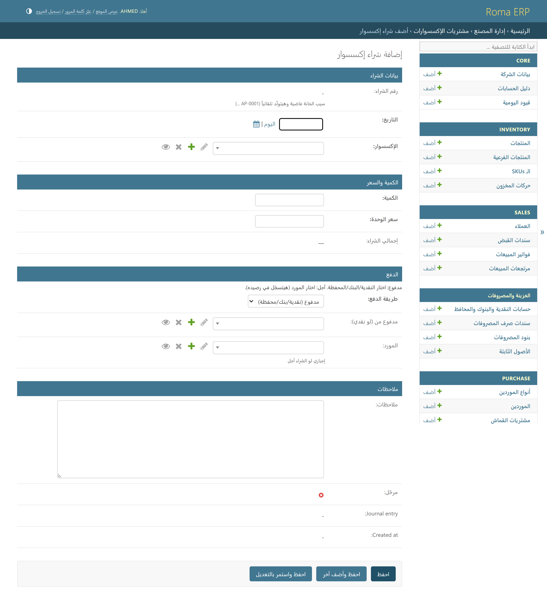

---

## 11. سندات دفع للموردين

**يعني إيه؟** عكس سند القبض. ده بيثبت إنك **دفعت** فلوس لمورد، وبيخصمها من رصيده (مديونيتنا له).

### الخطوات:
1. دوس **سندات دفع للموردين** ← **إضافة** (أو استخدم زر **💰 ادفع** اللي جنب المورد — أسرع).
2. اختار **التاريخ** و**المورد**.
3. في قسم **الدفع**: **طريقة الدفع**، **المبلغ**، و**مرجع** (رقم الشيك مثلاً، اختياري).
4. دوس **حفظ**، راجع، وبعدين **حفظ وترحيل** — رصيد المورد هينزل بالمبلغ اللي دفعته.

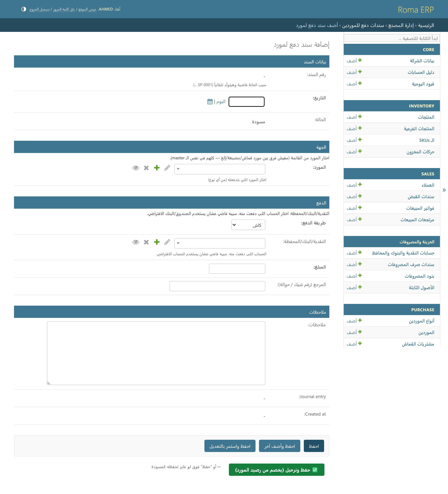

---

# قسم إدارة المصنع

> القسم ده للمصنع: إعداد بيانات القماش والألوان، وإدارة دورة الإنتاج كاملة.

## 12. ألوان القماش

**الغرض:** قائمة بكل ألوان القماش اللي بتستخدمها، عشان تختار منها في باقي الشاشات.

### الخطوات:
1. دوس **ألوان القماش** ← **إضافة**.
2. اكتب **الاسم بالعربي**، و(اختياري) **كود اللون hex** (لو كتبته بيظهر مربع باللون جنبه).
3. علّم **خام** ✓ لو ده لون قماش خام (يعني قبل ما يتصبغ).
4. دوس **حفظ**.

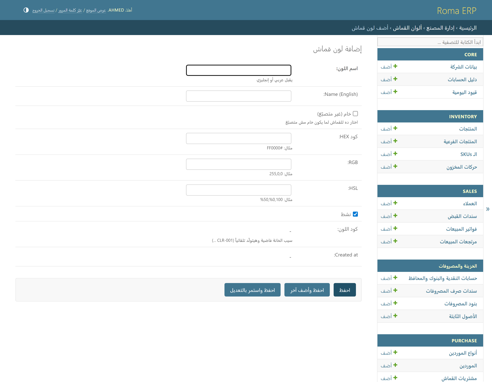

---

## 13. أنواع القماش

**الغرض:** قائمة بأنواع القماش (قطن، بوليستر، لايكرا...).

### الخطوات:
1. دوس **أنواع القماش** ← **إضافة**.
2. اكتب **الاسم بالعربي** و**الوصف** (اختياري).
3. دوس **حفظ**.

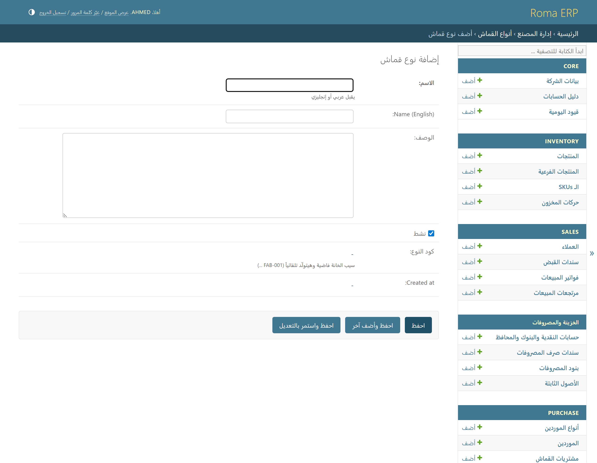

---

## 14. أوامر الإنتاج (أهم شاشة في المصنع)

**الغرض:** تدير دورة التصنيع كاملة من أول التخطيط لحد ما المنتج يخلص ويتحط في المخزن — والسيستم يخصم القماش ويعمل كل القيود لوحده.

### الأمر بيمر بمرحلتين (زي المسوّدة والترحيل بس بأسماء المصنع):

1. **خطة:** بتختار الموديل وكميات المقاسات، تطبع ورقة، وتسلّمها للمشرفين في المصنع.
2. **انتج:** بعد ما المصنع يخلّص، بتدوس زر "انتج" مرة واحدة — فالسيستم يخصم القماش (بالكمية بالهالك من الوصفة)، يضيف المنتج التام للمخزن، يعمل كل القيود، ويقفل الأمر. **مفيش إدخال كميات يدوي** — القماش والإكسسوارات كلها بتيجي من وصفة المنتج الرئيسي.

### الخطوات بالتفصيل:

#### أ. إنشاء الأمر (مرحلة الخطة)
1. دوس **أوامر الإنتاج** ← **إضافة أمر إنتاج**.
2. في **بيانات الأمر**:
   - **التاريخ**.
   - **الموديل (منتج فرعي)** (إجباري) — اختار الموديل الفرعي من القائمة. **لازم يكون متعرّف قبل كده** في «المنتجات الفرعية» (قسم INVENTORY).
     - **اسم الأمر بييجي تلقائياً** من اسم الموديل — مفيش خانة «اسم/وصف الموديل» تكتبها بإيدك.
     - **نوع القماش** بييجي من المنتج الرئيسي، و**لون القماش اللي هيتخصم** بييجي من الموديل الفرعي نفسه.
   - **العميل** (اختياري — لو الأمر مخصوص لعميل).
   - **رقم الأمر** و**الحالة** للقراءة فقط (بيتولّدوا لوحدهم).
3. **كميات المقاسات:** لكل سطر اختار **المقاس** واكتب **الكمية** المطلوب إنتاجها. تقدر كمان تربط السطر بـ **ملاحظة منتج / بيانات قص** من القائمة (أو تعمل واحدة جديدة بزر ➕) — دي اللي بيشتغل عليها القصّاص (الصدر/الظهر/الكم...).
4. **مجموعات التشغيل** (اختياري): لكل مجموعة اكتب الاسم + المكنة + كميات المراحل (تشغيل/تشطيب/جودة/كوي). السيستم بينبّهك لو مجموع أي مرحلة مش مساوي لإجمالي القطع.

> 🟦 **مفيش إدخال يدوي للقماش أو الإكسسوارات!** جدول «استهلاكات القماش» **للعرض فقط** وبيتعبّى لوحده من وصفة المنتج الرئيسي. والإكسسوارات بتتحمّل لوحدها برضه من الوصفة. انت مش بتدخّل أي كميات قماش أو إكسسوار بإيدك.

5. دوس زر **📋 حفظ وحمّل الإكسسوارات + افحص القماش** (الأزرق تحت). ده:
   - بيحفظ الأمر.
   - **بيحمّل الإكسسوارات تلقائياً** من وصفة المنتج (بالكميات حسب عدد القطع).
   - **بيفحص توافر القماش** ويحسب الكمية المتوقعة (قبل/بالهالك) — ولو القماش مش مكفّي بينبّهك.

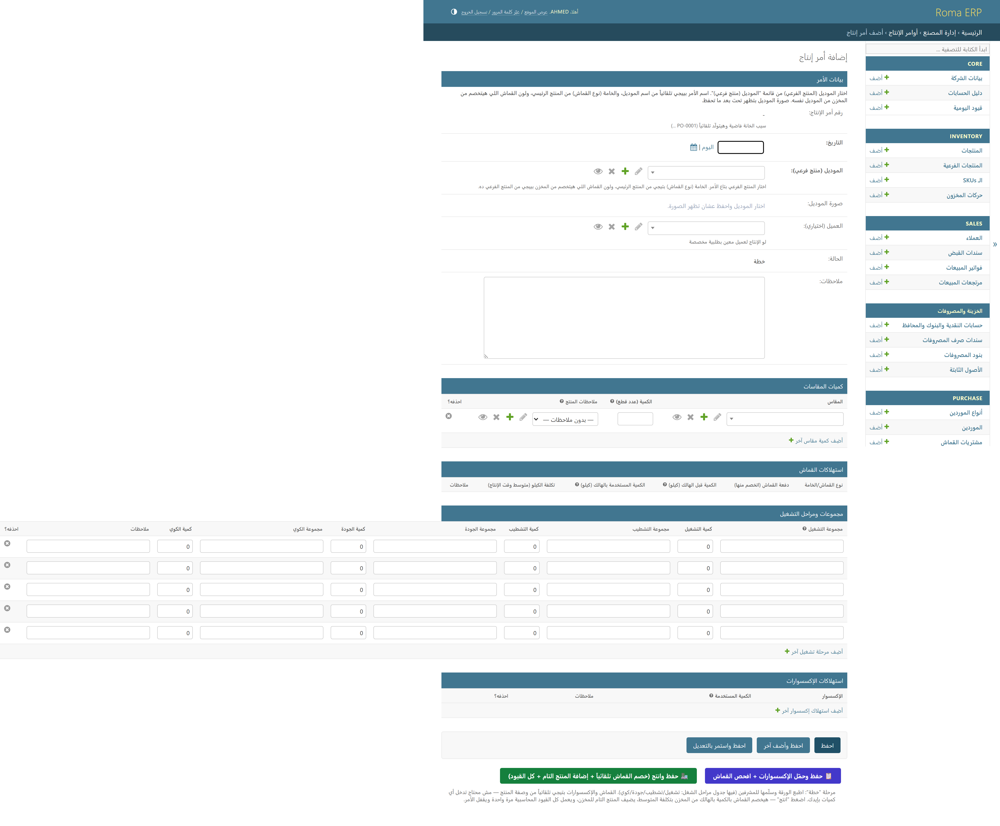

#### ب. طباعة ورقة الخطة وتسليمها للمصنع
6. دوس زر **🖨️ طباعة ورقة الأمر كاملة** (فوق على الشمال) واطبعها.
7. الورقة فيها **جدول مراحل الشغل** (تشغيل/تشطيب/جودة/كوي) عشان المشرفين يملوه بخط إيدهم وقت التسليم.

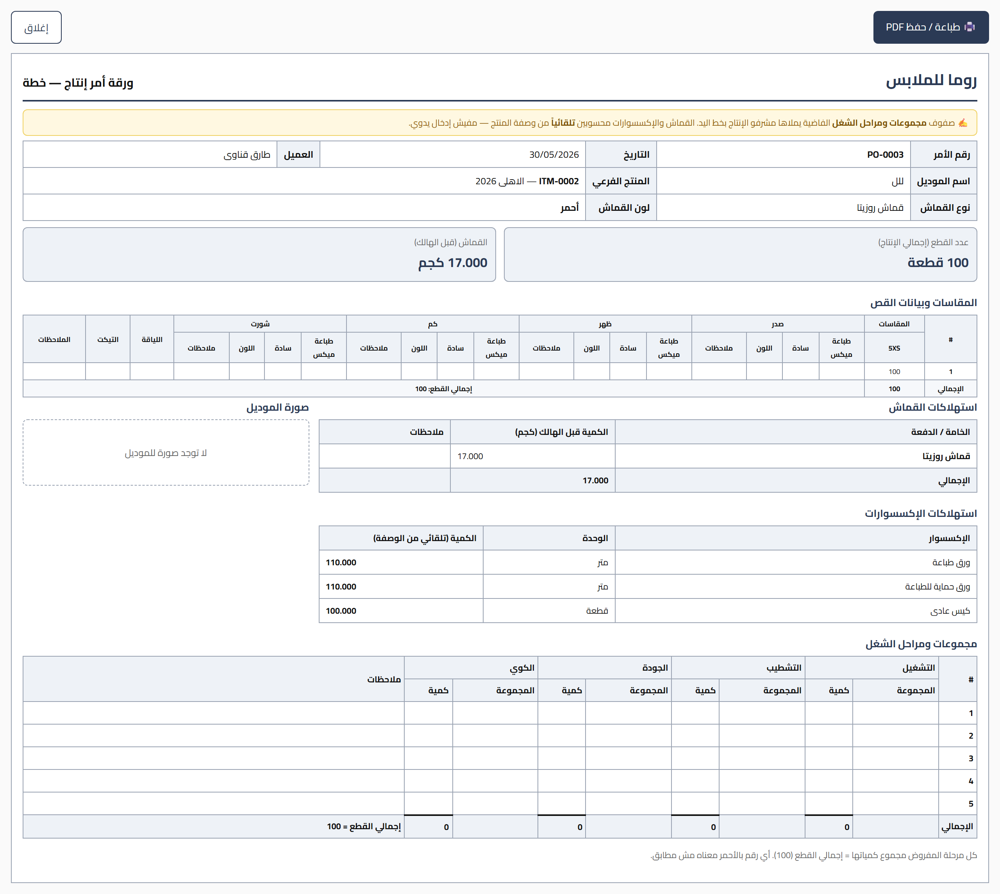

#### ج. الإنتاج (مرحلة انتج)
8. بعد ما المصنع يخلّص، افتح نفس الأمر ودوس زر **🏭 حفظ وانتج** (الأخضر تحت). السيستم هيعمل كل ده مرة واحدة لوحده:
   - **يخصم القماش** من المخزن **بالكمية بالهالك** من دفعات **نفس النوع واللون** بتكلفة **المتوسط (average)**.
   - **يضيف المنتج التام** للمخزن، **كل مقاس بتكلفته هو** (مش متوسط موحّد).
   - **يكتب كل القيود المحاسبية** (قماش/إكسسوار/مصنعية تحت التشغيل، وبعدين المنتج التام).
   - **يقفل الأمر** (الحالة تبقى "تم الإنتاج").

> **مهم تعرفه:** المصنعية بتترسمل في تكلفة المخزون مقابل **مستحق** في الميزانية (بتتدفع للعمال لاحقاً من شاشة سندات الدفع).

#### د. مراجعة التكلفة (بعد الإنتاج)
9. في آخر صفحة الأمر هتلاقي جدول **«تكلفة كل مقاس لوحده»**: لكل مقاس بيوريك القماش + الإكسسوار + المصنعية + **تكلفة الوحدة** + تكلفة المقاس كله.
   - كل مقاس متحسوب **بتكلفته هو** — مش متوسط موحّد على كل المقاسات.
   - **مجموع (تكلفة الوحدة × الكمية)** لكل المقاسات بيساوي **إجمالي تكلفة الأمر** بالظبط.

> **خطأ شائع:** اختيار **لون قماش غلط** على الموديل الفرعي → الخصم بيتم من رصيد لون تاني. اتأكد إن لون الموديل صح قبل ما تدوس «انتج».

---

## 15. الإكسسوارات

**الغرض:** قائمة بالإكسسوارات (أزرار، خيط، أستيك...) بأسعارها، عشان تستخدمها في أوامر الإنتاج.

### الخطوات:
1. دوس **الإكسسوارات** ← **إضافة**.
2. اكتب **الاسم بالعربي**، **الوحدة** (قطعة / متر / بكرة...)، و**تكلفة الوحدة الافتراضية**.
3. دوس **حفظ** (الكود تلقائي).

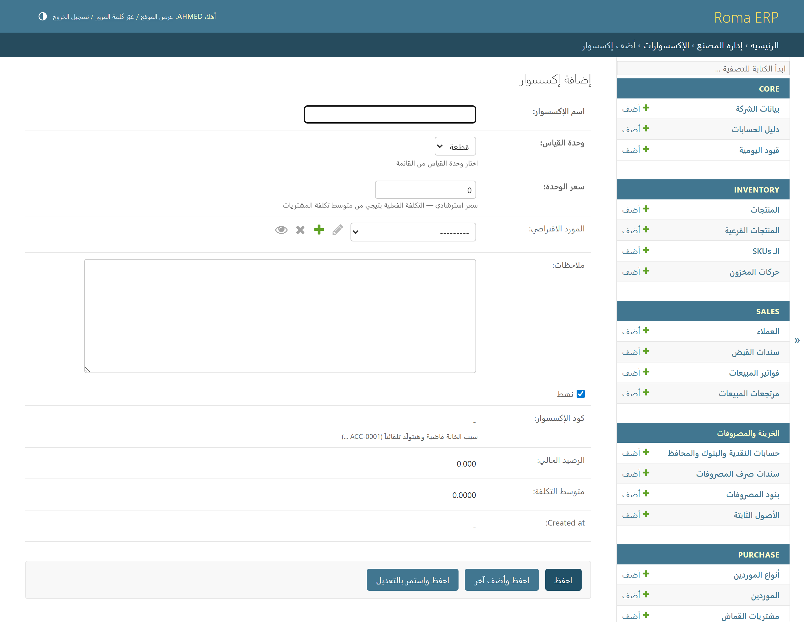

---

## 16. المقاسات

**الغرض:** قائمة بكل المقاسات (S, M, L, أو أرقام 38, 40...) المستخدمة في السيستم كله.

### الخطوات:
1. دوس **المقاسات** ← **إضافة**.
2. اكتب **الكود** (اسم المقاس) و**ترتيب الظهور** (رقم عشان يترتبوا صح في الجداول — مثلاً S قبل M قبل L).
3. دوس **حفظ**.

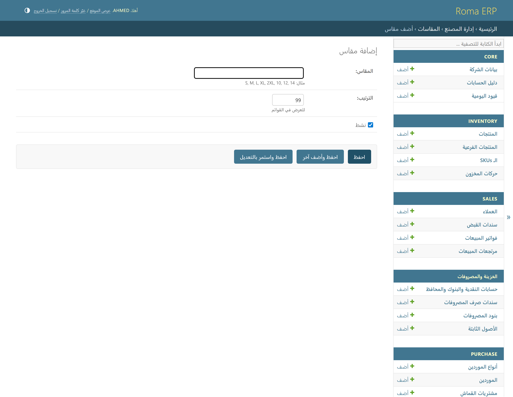

> **تعمل ده امتى؟** مرة واحدة في الأول. بعد كده المقاسات جاهزة لكل المنتجات.

---

## 17. حركات القماش (شاشة للاطلاع فقط)

**الغرض:** سجل بكل حركة قماش (استلام شراء، صرف للإنتاج...). **شاشة قراءة فقط** — بتتولّد لوحدها.

### الخطوات:
1. دوس **حركات القماش**.
2. فلتر بنوع الحركة أو التاريخ أو دفعة القماش عشان تتابع رصيد قماش معيّن.

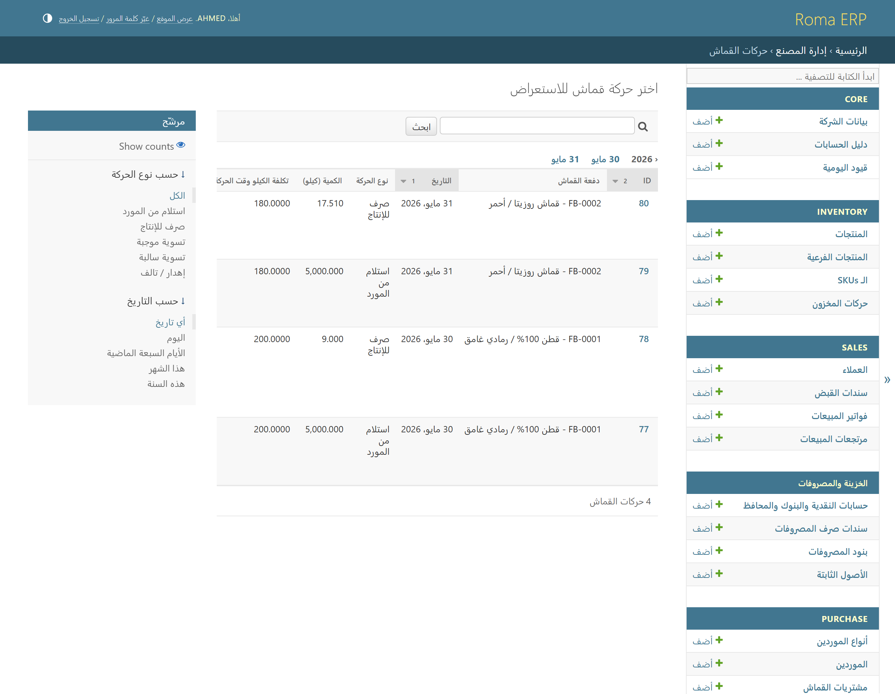

---

## 18. ملاحظات المنتج

**الغرض:** بيانات القص والملاحظات بتتعمل غالباً من **جوه أمر الإنتاج** (خطوة 14). الشاشة دي بتجمّع كل الملاحظات في مكان واحد للمراجعة.

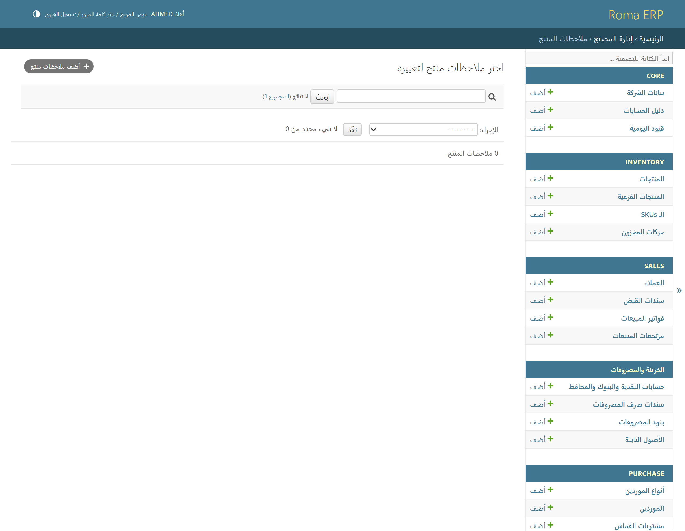

---

# قاموس المصطلحات (ارجعله أي وقت)

| المصطلح | المعنى ببساطة |
|---|---|
| **مسوّدة (Draft)** | المستند لسه بتجهّزه، تقدر تعدّل، ومبيأثرش على حاجة. |
| **ترحيل (Post)** | تثبيت المستند للحقيقي — بيحرّك المخزن والحسابات ويتقفل. |
| **رصيد العميل** | الفلوس اللي العميل مدين لك بيها. |
| **رصيد المورد** | الفلوس اللي انت مدين بيها للمورد. |
| **كشف حساب** | قائمة بكل حركات عميل أو مورد (فواتير ودفعات). |
| **صنف** | الموديل/المنتج (مثلاً: بيجامة صيفي). |
| **SKU** | منتج بمقاس محدد (بيجامة صيفي مقاس L). |
| **دستة** | وحدة بيع جملة = مجموعة قطع (افتراضياً 12). |
| **مخزون / رصيد المخزن** | عدد القطع المتاحة فعلاً عندك. |
| **قيد محاسبي** | تسجيل مالي بيكتبه السيستم لوحده عند الترحيل. |
| **إجمالي** | المجموع اللي السيستم بيحسبه (متكتبهوش بإيدك). |
| **سند قبض** | إثبات استلام فلوس من عميل. |
| **سند دفع** | إثبات دفع فلوس لمورد. |
| **دفعة قماش / Batch** | شحنة قماش اشتريتها مرة واحدة بلون ونوع. |
| **حد الائتمان** | أقصى مديونية مسموحة للعميل. |
| **آجل** | الدفع بعدين (مش كاش حالاً). |
| **حساب نقدية/بنك/محفظة** | مكان فلوسك: خزنة كاش، حساب بنكي، أو محفظة إلكترونية. تختار منه فلوس القبض/الدفع. |
| **سند مصروف** | تسجيل فلوس طلعت من الشركة مش شراء بضاعة (مرتب، إيجار، صيانة...). |
| **أصل ثابت** | حاجة بتفضل مع الشركة سنين (مكنة، عربية، أثاث) — مش بضاعة بتتباع. |

---

# نصايح أخيرة (مهمة لكل موظف)

1. **اشتغل على المسوّدة براحتك.** ضيف وامسح وجرّب — مفيش أي تأثير لحد ما ترحّل.
2. **راجع قبل الترحيل.** الترحيل خطوة بتغيّر المخزن والحسابات. ثانية مراجعة بتوفّر تعب كتير.
3. **متكتبش في الخانات المحسوبة.** الأكواد والإجماليات والأرصدة السيستم بيعملها.
4. **لو لقيت غلط بعد الترحيل،** فيه دايماً زر إلغاء بيعكس العملية — مفيش حاجة بتضيع، بس بحرص.
5. **لو حاجة مش واضحة، اسأل المدير قبل ما ترحّل.** المسوّدة بتستناك، مفيش عجلة.
6. **احفظ باسوردك سرّي**، واقفل الجلسة لو سايب الجهاز.
